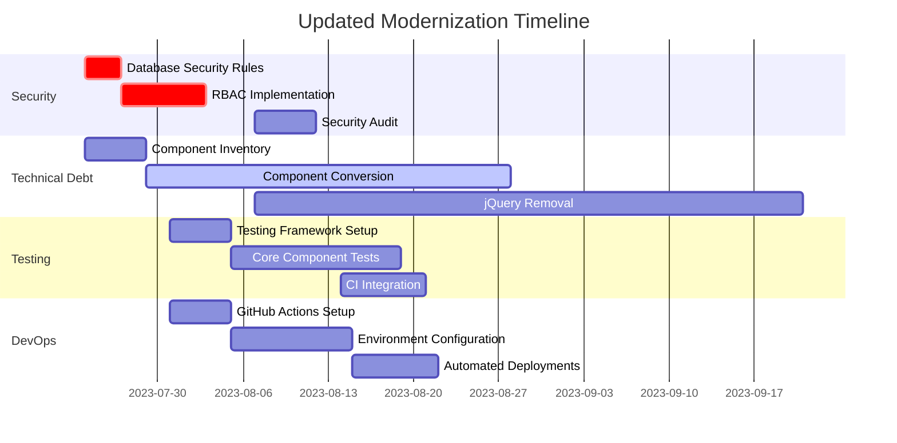

# Response to Modernization Review Findings

## Executive Summary

We have reviewed the Modernization Review Findings document and acknowledge the critical issues identified. This document outlines our response to these findings and the actions we will take to address them. Our response prioritizes security vulnerabilities, technical debt reduction, and process improvements while maintaining our current modernization timeline.

## Current Progress Assessment

We have made significant progress in the Discovery and Planning phase:

- **Documentation**: 10/10 feature documentations and 10/10 workflow documentations completed
- **Architecture**: 8/8 Architecture Decision Records (ADRs) created, with 1 accepted and 7 proposed
- **Planning**: Comprehensive Discovery Phase Project Plan established

However, we acknowledge the gaps identified in the review, particularly around security, testing, and implementation progress.

## Response to Critical Findings

### 1. Security Vulnerabilities

**Finding**: Critical security vulnerabilities including public database access and lack of RBAC.

**Response**: We agree this is the highest priority issue and will address it immediately.

**Actions**:

1. **Immediate (Next 7 Days)**:
   - Update Firebase database security rules to restrict public access
   - Implement basic RBAC in Firebase Authentication
   - Add security scanning to our development process

2. **Short-Term (30 Days)**:
   - Complete implementation of ADR-007 (Authentication and Authorization)
   - Conduct security audit of existing codebase
   - Implement comprehensive RBAC system
   - Address identified XSS vulnerabilities

3. **Documentation Updates**:
   - Add security implementation details to ADR-007
   - Create security best practices guide for developers

### 2. Technical Debt

**Finding**: 92% class components, jQuery in 78 files, and outdated patterns.

**Response**: We acknowledge the significant technical debt and will accelerate our modernization efforts.

**Actions**:

1. **Immediate (Next 7 Days)**:
   - Create component inventory with modernization status tracking
   - Establish component modernization priority list
   - Begin converting highest-priority components to functional components

2. **Short-Term (30 Days)**:
   - Convert at least 30% of components to functional components
   - Begin systematic jQuery removal
   - Implement TypeScript in new components
   - Create migration guides for developers

3. **Documentation Updates**:
   - Update ADR-001 with component migration strategy
   - Create technical debt reduction roadmap

### 3. Testing Gap

**Finding**: 0% test coverage (industry standard: 80%+).

**Response**: We recognize the critical lack of testing and will implement a comprehensive testing strategy.

**Actions**:

1. **Immediate (Next 7 Days)**:
   - Set up testing framework (Jest, React Testing Library)
   - Create initial test templates
   - Begin writing tests for critical components

2. **Short-Term (30 Days)**:
   - Achieve 20% test coverage for core components
   - Implement CI pipeline with automated testing
   - Create testing guidelines for developers
   - Add end-to-end testing with Cypress

3. **Documentation Updates**:
   - Add testing strategy to architecture documentation
   - Update ADR-008 with CI/CD testing requirements

### 4. Performance Issues

**Finding**: 4.8s load time (industry standard: <2s), 4.2MB bundle size.

**Response**: We will address performance as part of our modernization efforts.

**Actions**:

1. **Immediate (Next 7 Days)**:
   - Establish performance baseline measurements
   - Identify critical performance bottlenecks
   - Implement basic bundle analysis

2. **Short-Term (30 Days)**:
   - Optimize critical rendering paths
   - Implement code splitting
   - Reduce bundle size through dependency optimization
   - Set up performance monitoring

3. **Documentation Updates**:
   - Add performance requirements to architecture documentation
   - Create performance optimization guide

### 5. Process Gaps

**Finding**: No CI/CD pipeline, manual deployments, no monitoring.

**Response**: We will accelerate implementation of our DevOps strategy.

**Actions**:

1. **Immediate (Next 7 Days)**:
   - Set up basic GitHub Actions workflow
   - Implement linting and code quality checks
   - Create development environment

2. **Short-Term (30 Days)**:
   - Implement full CI/CD pipeline based on ADR-008
   - Set up staging and production environments
   - Implement automated deployments
   - Add basic monitoring and alerting

3. **Documentation Updates**:
   - Finalize ADR-008 (Deployment and DevOps)
   - Create deployment documentation

## Updated Implementation Roadmap

Based on the review findings, we have updated our implementation roadmap to prioritize critical issues:

## Resource Allocation

To address these critical issues, we are adjusting our resource allocation:

| Role | Previous Allocation | Updated Allocation | Focus Areas |
|------|---------------------|-------------------|-------------|
| Technical Lead | 100% | 100% | Security, Architecture |
| Frontend Developer | 100% | 100% | Component Modernization, Testing |
| Backend Developer | 100% | 100% | Security, API Layer |
| DevOps Engineer | 0% | 50% (New) | CI/CD, Monitoring |
| Security Specialist | 0% | 25% (Contract) | Security Audit, RBAC |

## Success Metrics

We have established the following success metrics to track our progress in addressing the review findings:

| Metric | Current | 30-Day Target | 90-Day Target |
|--------|---------|---------------|---------------|
| Security Rules Implementation | 0% | 100% | 100% |
| RBAC Implementation | 0% | 50% | 100% |
| Functional Components | 8% | 30% | 70% |
| jQuery Presence | 78 files | 50 files | 0 files |
| Test Coverage | 0% | 20% | 50% |
| Load Time | 4.8s | 3.5s | 2.2s |
| Bundle Size | 4.2MB | 3.0MB | 2.0MB |
| CI/CD Pipeline | None | Basic | Complete |

## Reporting and Monitoring

To ensure transparency and accountability in addressing these issues:

1. **Weekly Status Reports**:
   - Component modernization progress
   - Security implementation status
   - Testing coverage metrics
   - Performance improvements

2. **Bi-Weekly Review Meetings**:
   - Review progress against targets
   - Address blockers and challenges
   - Adjust priorities as needed

3. **Monthly Security Assessments**:
   - Review security implementation
   - Identify new vulnerabilities
   - Update security roadmap

## Conclusion

We take the findings from the modernization review seriously and have adjusted our plans to address the critical issues identified. By prioritizing security, reducing technical debt, implementing testing, improving performance, and enhancing our development processes, we will create a more robust and maintainable system.

Our updated approach maintains the comprehensive documentation we've created while accelerating the implementation of critical improvements. We are committed to meeting the targets outlined in this response and will provide regular updates on our progress.

---

*Response Date: July 23, 2023*  
*Prepared by: Hypatia Modernization Team*
