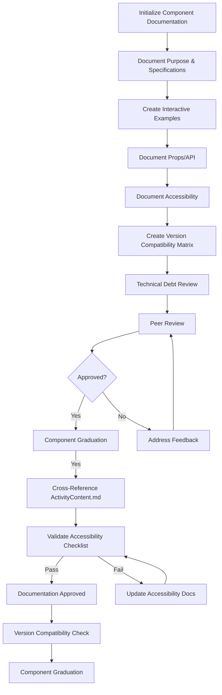

# Component Documentation Workflow

This document outlines the systematic workflow for documenting components in the Hypatia LMS modernization project. Following this workflow ensures consistent, comprehensive, and high-quality documentation across the component library.

## Workflow Overview

## Detailed Workflow Steps

### 1. Initialize Component Documentation

**Owner:** Assigned developer  
**Inputs:** Component source code, component-template.md  
**Outputs:** Initial component documentation file  

**Process:**
1. Identify the component to document from documentation-progress.md
2. Create a new Markdown file in the appropriate directory using the component-template.md template
3. Fill in the component name and create a skeleton for all required sections
4. Update documentation-progress.md to mark the component as "In Progress"
5. Create a new branch for the documentation work (format: `docs/component-name`)
6. Commit the initial documentation file

**Validation:**
- File follows the correct naming convention
- All template sections are present
- Documentation-progress.md is updated correctly

### 2. Document Purpose & Specifications

**Owner:** Assigned developer  
**Inputs:** Component source code, design specifications  
**Outputs:** Completed purpose and specifications sections  

**Process:**
1. Review the component source code to understand its purpose and functionality
2. Document the component description, including its role in the application
3. Document key features and use cases
4. Document any design principles or guidelines specific to the component
5. Commit changes with message "docs(ComponentName): Add purpose and specifications"

**Validation:**
- Description clearly explains the component's purpose
- Use cases are comprehensive and realistic
- Design principles are documented if applicable
- Commit is atomic and focused on purpose/specifications only

### 3. Create Interactive Examples

**Owner:** Assigned developer  
**Inputs:** Component source code, existing usage patterns  
**Outputs:** Code examples and Storybook stories  

**Process:**
1. Create basic usage examples for the component
2. Create examples for different variants and states
3. Create examples for common use cases
4. Create a Storybook story file that implements these examples
5. Test all examples to ensure they work correctly
6. Add links to Storybook examples in the documentation
7. Commit changes with message "docs(ComponentName): Add interactive examples"

**Validation:**
- Examples cover basic usage and common variants
- Examples are syntactically correct
- Storybook stories match documentation examples
- Examples demonstrate real-world usage patterns
- Live code sandbox links are functional

### 4. Document Props/API

**Owner:** Assigned developer  
**Inputs:** Component source code, TypeScript definitions  
**Outputs:** Completed props table and type definitions  

**Process:**
1. Identify all props accepted by the component
2. Document each prop's name, type, default value, and description
3. Create a props table following the template format
4. Document complex type definitions using TypeScript interfaces
5. Document any methods or event handlers
6. Commit changes with message "docs(ComponentName): Add props and API documentation"

**Validation:**
- All props are documented accurately
- Types match the actual implementation
- Default values are correctly specified
- Required props are clearly marked
- Complex types have detailed explanations

### 5. Document Accessibility

**Owner:** Assigned developer  
**Inputs:** Component source code, accessibility guidelines  
**Outputs:** Completed accessibility section and compliance report  

**Process:**
1. Review the component for accessibility features
2. Document keyboard navigation support
3. Document screen reader compatibility
4. Document ARIA attributes used
5. Document color contrast considerations
6. Create an accessibility compliance report using the accessibility-checklist.md
7. Commit changes with message "docs(ComponentName): Add accessibility documentation"

**Validation:**
- Accessibility features are accurately documented
- Keyboard navigation is fully explained
- Screen reader behavior is documented
- ARIA attributes are listed and explained
- Color contrast considerations are addressed
- Compliance report identifies any issues

### 6. Create Version Compatibility Matrix

**Owner:** Assigned developer  
**Inputs:** Component version history, breaking changes  
**Outputs:** Completed version compatibility matrix  

**Process:**
1. Research the component's version history
2. Identify any breaking changes or significant updates
3. Create a version compatibility matrix showing support across versions
4. Document migration paths for deprecated features
5. Commit changes with message "docs(ComponentName): Add version compatibility matrix"

**Validation:**
- Version history is accurate and complete
- Breaking changes are clearly identified
- Migration paths are provided for deprecated features
- Matrix format is consistent with other components

### 7. Technical Debt Review

**Owner:** Assigned developer  
**Inputs:** Component source code, component-library-documentation-plan.md  
**Outputs:** Technical debt section with identified issues  

**Process:**
1. Review the component for technical debt issues
2. Identify incomplete legacy patterns
3. Document deprecated prop migrations
4. List required future optimizations
5. Create technical debt records with issue IDs
6. Cross-reference technical debt records in the documentation
7. Commit changes with message "docs(ComponentName): Add technical debt review"

**Validation:**
- Technical debt issues are accurately identified
- Legacy patterns are documented
- Deprecated props have migration paths
- Future optimizations are clearly described
- Technical debt records are cross-referenced

### 8. Peer Review

**Owner:** Reviewer (different developer)  
**Inputs:** Completed documentation, documentation-checklist.md  
**Outputs:** Review comments, approval or change requests  

**Process:**
1. Reviewer checks documentation against documentation-checklist.md
2. Reviewer verifies accuracy of all sections
3. Reviewer tests examples and verifies they work
4. Reviewer provides feedback as comments or change requests
5. Assigned developer addresses any feedback
6. Reviewer approves documentation when all issues are resolved

**Validation:**
- Documentation meets all checklist requirements
- All sections are accurate and complete
- Examples work as described
- Technical debt is properly documented
- Documentation follows project standards

### 9. Component Graduation

**Owner:** Frontend Lead  
**Inputs:** Approved documentation  
**Outputs:** Updated documentation-progress.md, merged documentation  

**Process:**
1. Frontend Lead performs final review
2. Documentation is merged into the main branch
3. Documentation-progress.md is updated to mark the component as "Complete"
4. Component is added to the component library index
5. Team is notified of the newly documented component

**Validation:**
- Documentation is complete and approved
- Documentation-progress.md is updated correctly
- Component is properly indexed
- Documentation is accessible to the team

## Workflow Automation

To streamline this process, the following automation tools are available:

1. **Documentation Initializer**: Script to create initial documentation files from the template
2. **Progress Tracker Updater**: Script to update documentation-progress.md automatically
3. **Validation Checker**: Script to validate documentation against the checklist
4. **Technical Debt Analyzer**: Tool to identify technical debt issues in components

## Workflow Metrics

The following metrics are tracked to measure the effectiveness of the documentation workflow:

1. **Documentation Completion Rate**: Percentage of components with complete documentation
2. **Documentation Quality Score**: Average score based on checklist compliance
3. **Documentation Time**: Average time to complete documentation for a component
4. **Review Efficiency**: Average number of review cycles before approval
5. **Technical Debt Identification**: Number of technical debt issues identified and documented

## Continuous Improvement

This workflow is subject to continuous improvement. Feedback and suggestions should be directed to the Frontend Lead.

## Related Documents

- [Component Template](../component-template.md)
- [Documentation Guide](../documentation-guide.md)
- [Documentation Checklist](../documentation-checklist.md)
- [Documentation Progress Tracker](../documentation-progress.md)
- [Component Library Documentation Plan](../component-library-documentation-plan.md)
- [Accessibility Checklist](./accessibility-checklist.md)
