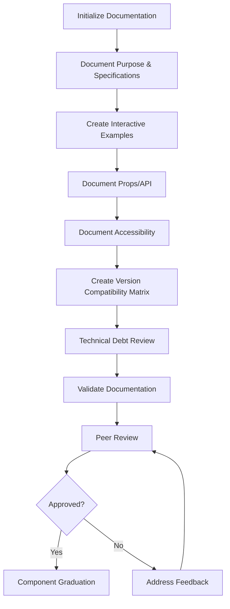
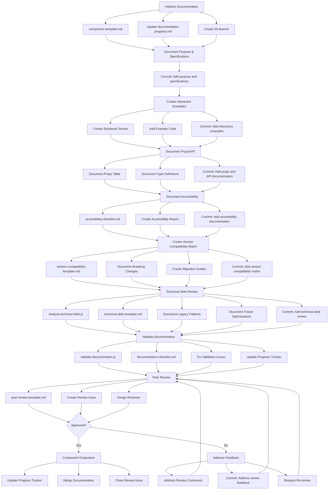
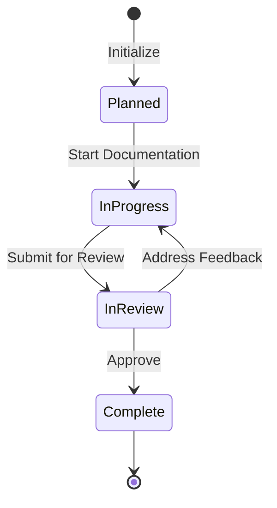
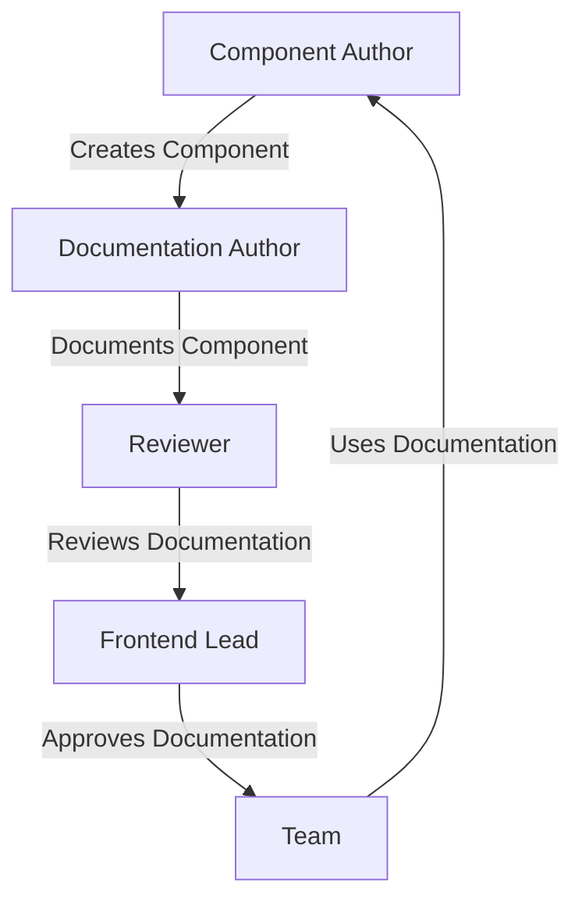
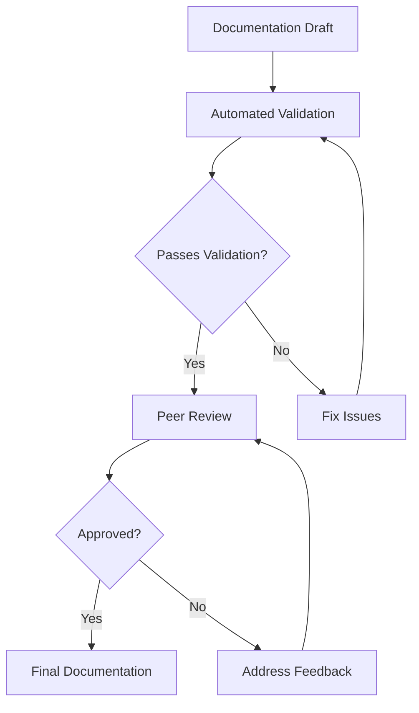
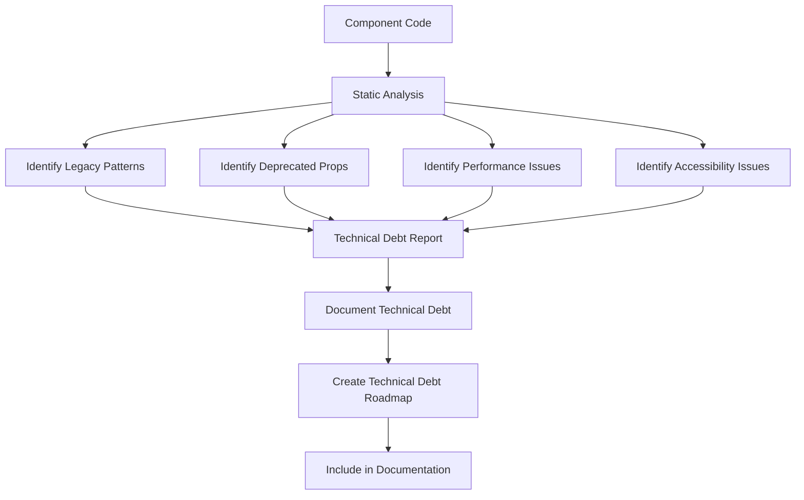
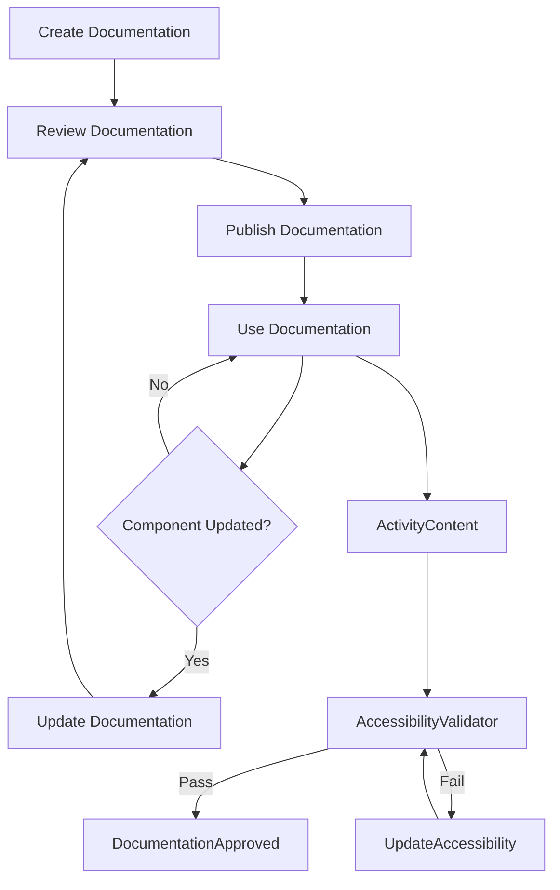
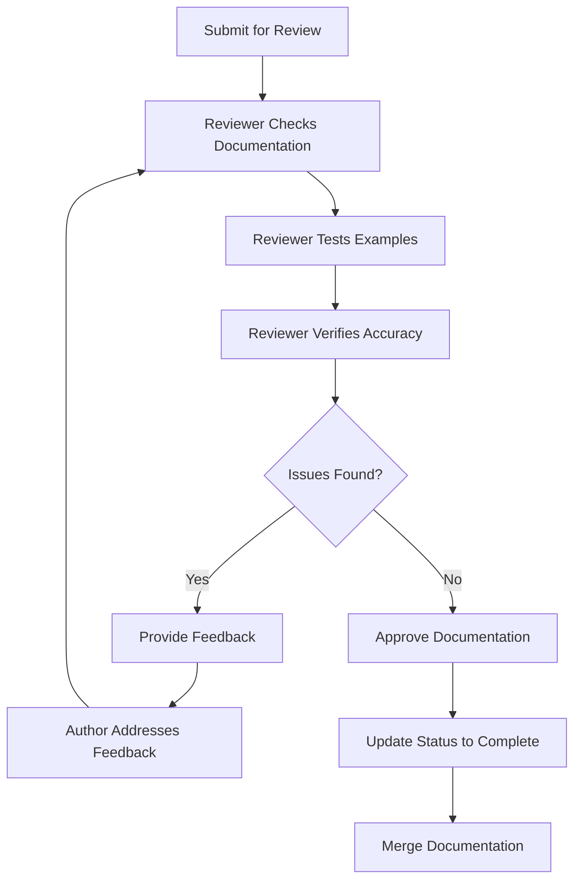
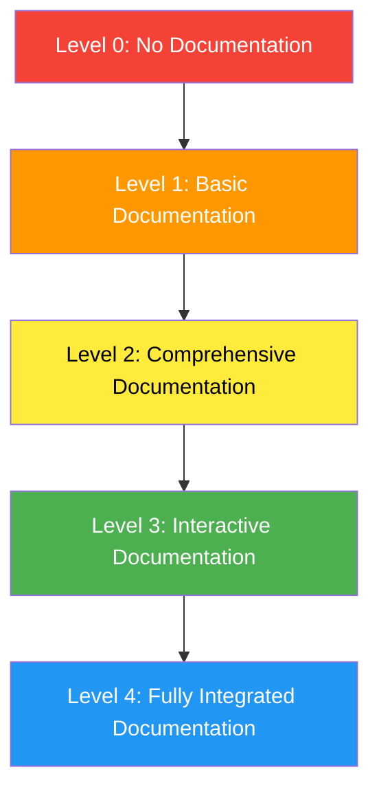
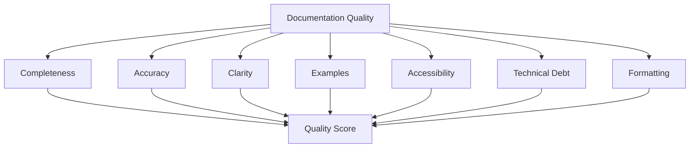

# Component Documentation Workflow Diagram

This document provides a visual representation of the component documentation workflow.

## High-Level Workflow

## Detailed Workflow with Artifacts

## Documentation Status Flow

## Roles and Responsibilities

## Documentation Validation Process

## Technical Debt Review Process

## Documentation Lifecycle

## Peer Review Process

## Component Documentation Maturity Model

## Documentation Quality Metrics

