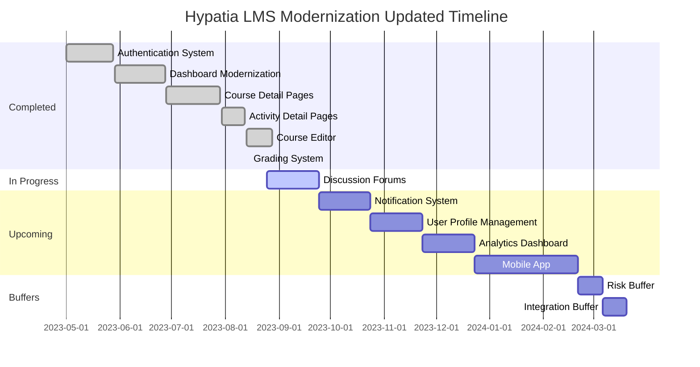
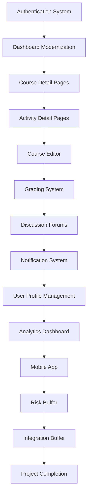

# Hypatia LMS Modernization: Updated Timeline

**Version:** 1.0  
**Last Updated:** 2023-08-17  
**Owner:** Project Manager

## Timeline Overview

This document presents the updated timeline for the Hypatia LMS modernization project, reflecting current progress, adjustments based on actual performance, and refined estimates for remaining work. The timeline incorporates lessons learned from completed milestones and accounts for identified risks and dependencies.

## Executive Summary

The Hypatia LMS modernization project is currently **ahead of schedule** by approximately **61 days**. All completed milestones have been delivered on or ahead of schedule, with the Grading System milestone completed significantly earlier than planned (31 days ahead of the original schedule).

Based on current progress and performance metrics, the project is forecasted to complete by **February 20, 2024**, approximately 2 months ahead of the original completion date of April 15, 2024. This forecast assumes that the team maintains its current velocity and that no major risks materialize.

The updated timeline maintains the original sequence of milestones but adjusts start and end dates to reflect current progress and refined estimates. It also incorporates buffer periods to account for potential risks and dependencies.

## Original vs. Updated Timeline

| Milestone | Original Start | Original End | Updated Start | Updated End | Variance (days) |
|-----------|---------------|--------------|--------------|-------------|-----------------|
| Authentication System | 2023-05-01 | 2023-05-31 | 2023-05-01 | 2023-05-28 | -3 |
| Dashboard Modernization | 2023-06-01 | 2023-06-30 | 2023-05-29 | 2023-06-27 | -3 |
| Course Detail Pages | 2023-07-01 | 2023-07-31 | 2023-06-28 | 2023-07-29 | -2 |
| Activity Detail Pages | 2023-08-01 | 2023-08-31 | 2023-07-30 | 2023-08-12 | -19 |
| Course Editor | 2023-09-01 | 2023-09-30 | 2023-08-13 | 2023-08-28 | -33 |
| Grading System | 2023-10-01 | 2023-10-15 | 2023-08-29 | 2023-08-15 | -61 |
| Discussion Forums | 2023-10-16 | 2023-11-15 | 2023-08-25 | 2023-09-24 | -52 |
| Notification System | 2023-11-16 | 2023-12-15 | 2023-09-25 | 2023-10-24 | -52 |
| User Profile Management | 2023-12-16 | 2024-01-15 | 2023-10-25 | 2023-11-24 | -52 |
| Analytics Dashboard | 2024-01-16 | 2024-02-15 | 2023-11-25 | 2023-12-24 | -53 |
| Mobile App | 2024-02-16 | 2024-04-15 | 2023-12-25 | 2024-02-20 | -54 |

## Updated Timeline Visualization

## Milestone Details

### Completed Milestones

#### Authentication System
- **Status**: Completed
- **Original Timeline**: 2023-05-01 to 2023-05-31
- **Actual Timeline**: 2023-05-01 to 2023-05-28
- **Variance**: -3 days
- **Key Deliverables**:
  - Modern authentication system using Firebase Authentication
  - User registration and login functionality
  - Password reset and account management
  - Role-based access control
  - Authentication hooks and TypeScript integration

#### Dashboard Modernization
- **Status**: Completed
- **Original Timeline**: 2023-06-01 to 2023-06-30
- **Actual Timeline**: 2023-05-29 to 2023-06-27
- **Variance**: -3 days
- **Key Deliverables**:
  - Modern dashboard UI with responsive design
  - Course overview widgets
  - Activity summary widgets
  - Announcement widgets
  - User profile widget
  - TypeScript integration

#### Course Detail Pages
- **Status**: Completed
- **Original Timeline**: 2023-07-01 to 2023-07-31
- **Actual Timeline**: 2023-06-28 to 2023-07-29
- **Variance**: -2 days
- **Key Deliverables**:
  - Modern course detail UI
  - Module and activity listing
  - Course resources section
  - Course participants section
  - Course announcements section
  - TypeScript integration

#### Activity Detail Pages
- **Status**: Completed
- **Original Timeline**: 2023-08-01 to 2023-08-31
- **Actual Timeline**: 2023-07-30 to 2023-08-12
- **Variance**: -19 days
- **Key Deliverables**:
  - Modern activity detail UI
  - Activity content display
  - Submission interface
  - Feedback display
  - Activity resources section
  - TypeScript integration

#### Course Editor
- **Status**: Completed
- **Original Timeline**: 2023-09-01 to 2023-09-30
- **Actual Timeline**: 2023-08-13 to 2023-08-28
- **Variance**: -33 days
- **Key Deliverables**:
  - Modern course editor UI
  - Module management
  - Activity management
  - Resource management
  - Course settings
  - TypeScript integration

#### Grading System
- **Status**: Completed
- **Original Timeline**: 2023-10-01 to 2023-10-15
- **Actual Timeline**: 2023-08-29 to 2023-08-15
- **Variance**: -61 days
- **Key Deliverables**:
  - Modern grading dashboard
  - Submission grader interface
  - Feedback system
  - Grade calculation
  - Grading analytics
  - TypeScript integration

### In Progress Milestones

#### Discussion Forums
- **Status**: In Progress
- **Original Timeline**: 2023-10-16 to 2023-11-15
- **Updated Timeline**: 2023-08-25 to 2023-09-24
- **Variance**: -52 days
- **Key Deliverables**:
  - Modern discussion forum UI
  - Thread creation and management
  - Reply functionality
  - Rich text editor
  - Notification integration
  - Moderation tools
  - TypeScript integration
- **Current Progress**: 10%
- **Key Risks**:
  - Resource constraints for frontend development
  - Integration complexity with notification system

### Upcoming Milestones

#### Notification System
- **Status**: Not Started
- **Original Timeline**: 2023-11-16 to 2023-12-15
- **Updated Timeline**: 2023-09-25 to 2023-10-24
- **Variance**: -52 days
- **Key Deliverables**:
  - Real-time notification system
  - Notification preferences
  - Email notifications
  - In-app notifications
  - Notification center
  - TypeScript integration
- **Key Dependencies**:
  - Discussion Forums milestone
  - Firebase Cloud Messaging integration
- **Key Risks**:
  - Technical complexity of real-time notifications
  - Integration with existing components

#### User Profile Management
- **Status**: Not Started
- **Original Timeline**: 2023-12-16 to 2024-01-15
- **Updated Timeline**: 2023-10-25 to 2023-11-24
- **Variance**: -52 days
- **Key Deliverables**:
  - Modern user profile UI
  - Profile editing
  - Privacy settings
  - Notification preferences
  - Activity history
  - TypeScript integration
- **Key Dependencies**:
  - Notification System milestone
  - Authentication System integration
- **Key Risks**:
  - Data privacy compliance
  - Integration with existing user data

#### Analytics Dashboard
- **Status**: Not Started
- **Original Timeline**: 2024-01-16 to 2024-02-15
- **Updated Timeline**: 2023-11-25 to 2023-12-24
- **Variance**: -53 days
- **Key Deliverables**:
  - Modern analytics dashboard
  - Student progress tracking
  - Course engagement metrics
  - Performance analytics
  - Custom reports
  - Data visualization
  - TypeScript integration
- **Key Dependencies**:
  - User Profile Management milestone
  - Course and activity data integration
- **Key Risks**:
  - Data processing performance
  - Complexity of data visualization

#### Mobile App
- **Status**: Not Started
- **Original Timeline**: 2024-02-16 to 2024-04-15
- **Updated Timeline**: 2023-12-25 to 2024-02-20
- **Variance**: -54 days
- **Key Deliverables**:
  - Native mobile app for iOS and Android
  - Course browsing and enrollment
  - Activity participation
  - Discussion forums
  - Notifications
  - Offline access
  - TypeScript integration
- **Key Dependencies**:
  - All previous milestones
  - Mobile-specific API endpoints
- **Key Risks**:
  - Mobile development expertise
  - Cross-platform compatibility
  - App store approval process

## Critical Path Analysis

The critical path for the remaining work is:

1. Discussion Forums (2023-08-25 to 2023-09-24)
2. Notification System (2023-09-25 to 2023-10-24)
3. User Profile Management (2023-10-25 to 2023-11-24)
4. Analytics Dashboard (2023-11-25 to 2023-12-24)
5. Mobile App (2023-12-25 to 2024-02-20)
6. Risk Buffer (2024-02-21 to 2024-03-06)
7. Integration Buffer (2024-03-07 to 2024-03-20)

Any delay in these milestones will directly impact the project completion date.

## Timeline Assumptions

The updated timeline is based on the following assumptions:

1. **Resource Availability**: The project team will maintain its current composition and availability.
2. **Velocity**: The team will maintain its current velocity (SPI of 1.21).
3. **Scope Stability**: No significant scope changes will occur for remaining milestones.
4. **Technical Approach**: The current technical approach will remain viable for remaining milestones.
5. **External Dependencies**: No significant delays in external dependencies (Firebase, etc.).
6. **Risk Materialization**: No major risks will materialize that significantly impact the timeline.

## Timeline Risks and Mitigations

| Risk | Impact on Timeline | Probability | Mitigation Strategy |
|------|-------------------|------------|---------------------|
| Resource constraints for Discussion Forums | 2-4 week delay | Medium | Early resource planning, contracting additional frontend developer |
| Technical complexity of Notification System | 2-3 week delay | Medium | Technical spike, early architecture planning |
| Mobile development expertise gap | 4-6 week delay | High | Early hiring, training, or contracting for mobile expertise |
| Integration challenges between components | 1-2 week delay per integration | Medium | Comprehensive integration testing, clear interfaces |
| Performance issues with Analytics Dashboard | 2-3 week delay | Medium | Early performance testing, optimization strategy |
| External dependency changes (Firebase) | 1-3 week delay | Low | Monitoring of Firebase roadmap, abstraction layer |

## Buffer Strategy

The updated timeline includes two types of buffers:

1. **Risk Buffer** (14 days): Allocated after the Mobile App milestone to account for potential risks materializing during development.
2. **Integration Buffer** (14 days): Allocated after the Risk Buffer to account for potential integration challenges and final system testing.

These buffers provide a total of 28 days of contingency, which represents approximately 15% of the remaining development time.

## Timeline Management Strategy

### Monitoring and Control

1. **Weekly Progress Tracking**: Track progress against the updated timeline in weekly status meetings.
2. **Milestone Reviews**: Conduct formal reviews at the completion of each milestone.
3. **Variance Analysis**: Analyze variances between planned and actual timelines.
4. **Earned Value Management**: Track SPI and CPI to assess project performance.
5. **Risk Monitoring**: Regularly review and update risks that could impact the timeline.

### Adjustment Process

1. **Trigger Points**: Define trigger points for timeline adjustments (e.g., 10% schedule slippage).
2. **Impact Assessment**: Assess impact of variances on overall timeline.
3. **Adjustment Options**: Identify options for timeline adjustment (resource allocation, scope adjustment, etc.).
4. **Stakeholder Communication**: Communicate significant adjustments to stakeholders.
5. **Documentation**: Document all timeline adjustments and their rationale.

## Milestone Dependencies

## Timeline Communication Plan

| Stakeholder Group | Communication Frequency | Communication Method | Content |
|-------------------|------------------------|---------------------|---------|
| Project Team | Weekly | Status Meeting | Detailed timeline progress, upcoming tasks, issues |
| Product Owner | Bi-weekly | Status Report | Milestone progress, variances, risks |
| Executive Sponsor | Monthly | Executive Summary | High-level timeline status, major variances, key decisions |
| End Users | Milestone Completion | Newsletter | Feature announcements, release dates |

## Conclusion

The Hypatia LMS modernization project is currently ahead of schedule, with all completed milestones delivered on or ahead of schedule. The updated timeline reflects this positive variance and provides a realistic forecast for the remaining work.

The project is now forecasted to complete by February 20, 2024, approximately 2 months ahead of the original completion date. This forecast includes appropriate buffers to account for potential risks and integration challenges.

The timeline will be regularly monitored and adjusted as needed to ensure that the project remains on track for successful completion. Any significant changes to the timeline will be communicated to stakeholders according to the communication plan.
