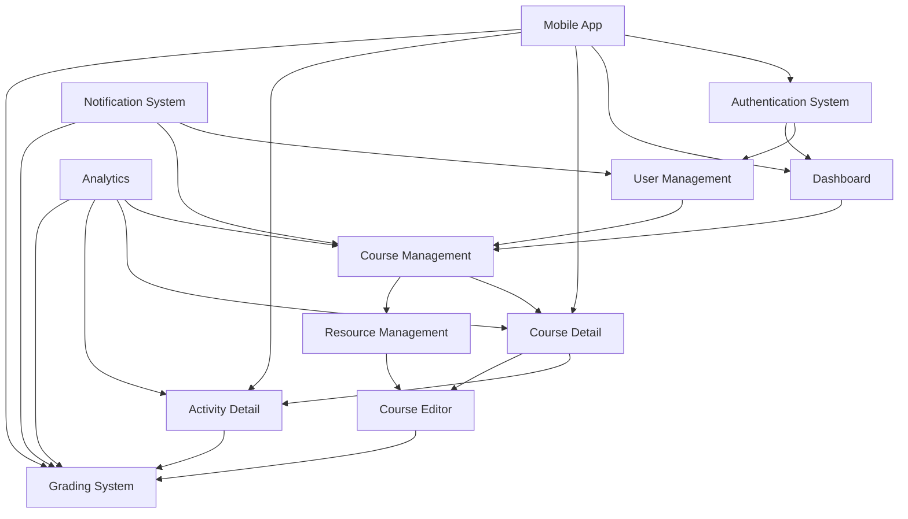
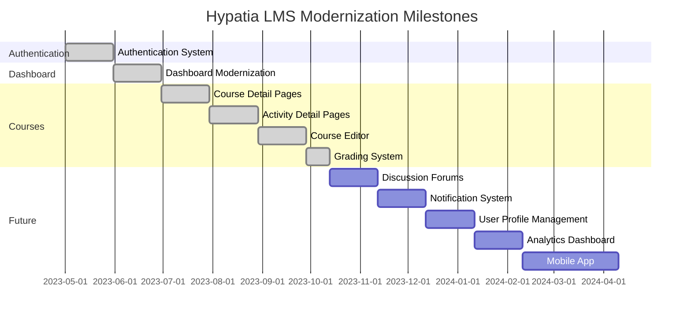

# Hypatia LMS Modernization: Dependency Map

**Version:** 1.0  
**Last Updated:** 2023-08-17  
**Owner:** Technical Lead

## Dependency Map Overview

This document maps the dependencies between different components, milestones, and external systems in the Hypatia LMS modernization project. Understanding these dependencies is crucial for identifying potential bottlenecks, planning work sequencing, and managing risks.

## Component Dependencies

### Component Dependency Details

| Dependent Component | Dependency | Type | Status | Impact |
|---------------------|------------|------|--------|--------|
| User Management | Authentication System | Internal | Complete | High |
| Dashboard | Authentication System | Internal | Complete | High |
| Course Management | User Management | Internal | Complete | High |
| Course Management | Dashboard | Internal | Complete | Medium |
| Course Detail | Course Management | Internal | Complete | High |
| Activity Detail | Course Detail | Internal | Complete | High |
| Course Editor | Course Detail | Internal | Complete | High |
| Grading System | Activity Detail | Internal | Complete | High |
| Grading System | Course Editor | Internal | Complete | Medium |
| Resource Management | Course Management | Internal | Complete | Medium |
| Course Editor | Resource Management | Internal | Complete | Medium |
| Notification System | User Management | Internal | Not Started | Medium |
| Notification System | Course Management | Internal | Not Started | Medium |
| Notification System | Grading System | Internal | Not Started | High |
| Analytics | Course Management | Internal | Not Started | Medium |
| Analytics | Course Detail | Internal | Not Started | Medium |
| Analytics | Activity Detail | Internal | Not Started | Medium |
| Analytics | Grading System | Internal | Not Started | High |
| Mobile App | Authentication System | Internal | Not Started | High |
| Mobile App | Dashboard | Internal | Not Started | Medium |
| Mobile App | Course Detail | Internal | Not Started | High |
| Mobile App | Activity Detail | Internal | Not Started | High |
| Mobile App | Grading System | Internal | Not Started | Medium |

## Milestone Dependencies

### Milestone Dependency Details

| Dependent Milestone | Dependency | Status | Critical Path | Risk Level |
|---------------------|------------|--------|---------------|------------|
| Dashboard Modernization | Authentication System | Complete | Yes | Low |
| Course Detail Pages | Dashboard Modernization | Complete | Yes | Low |
| Activity Detail Pages | Course Detail Pages | Complete | Yes | Low |
| Course Editor | Activity Detail Pages | Complete | Yes | Low |
| Grading System | Course Editor | Complete | Yes | Low |
| Discussion Forums | Grading System | Not Started | Yes | Medium |
| Notification System | Discussion Forums | Not Started | Yes | Medium |
| User Profile Management | Notification System | Not Started | Yes | Medium |
| Analytics Dashboard | User Profile Management | Not Started | Yes | Medium |
| Mobile App | Analytics Dashboard | Not Started | Yes | High |

## External Dependencies

| External Dependency | Type | Status | Impact | Mitigation Strategy |
|--------------------|------|--------|--------|---------------------|
| Firebase Authentication | Service | Active | High | Monitor service status, implement fallback authentication |
| Firebase Firestore | Service | Active | High | Implement caching, monitor service status |
| Firebase Storage | Service | Active | Medium | Implement local storage fallback |
| React | Library | Stable | High | Lock version, test upgrades thoroughly |
| Redux | Library | Stable | High | Lock version, test upgrades thoroughly |
| TypeScript | Language | Stable | High | Lock version, test upgrades thoroughly |
| Jest | Testing | Stable | Medium | Lock version, test upgrades thoroughly |
| Node.js | Runtime | Stable | Medium | Lock version, test upgrades thoroughly |
| npm | Package Manager | Stable | Medium | Lock version, use package-lock.json |
| Browser Compatibility | External | Variable | Medium | Cross-browser testing, polyfills |

## Critical Path Analysis

The critical path for the Hypatia LMS modernization project is:

1. Authentication System
2. Dashboard Modernization
3. Course Detail Pages
4. Activity Detail Pages
5. Course Editor
6. Grading System
7. Discussion Forums
8. Notification System
9. User Profile Management
10. Analytics Dashboard
11. Mobile App

Any delay in these milestones will directly impact the project timeline.

## Dependency Bottlenecks

| Bottleneck | Description | Impact | Mitigation Strategy |
|------------|-------------|--------|---------------------|
| Firebase Firestore Performance | Performance degradation with large datasets | High | Implement pagination, caching, and optimized queries |
| React Component Reusability | Dependency on common components across features | Medium | Develop a component library with clear documentation |
| Testing Dependencies | Test coverage dependencies on component implementation | Medium | Implement test-driven development approach |
| Browser Compatibility | Dependency on modern browser features | Medium | Implement feature detection and graceful degradation |
| Developer Knowledge | Dependency on developer familiarity with modern technologies | Medium | Provide training, documentation, and pair programming |

## Dependency Risk Assessment

| Dependency Risk | Probability | Impact | Risk Score | Mitigation Strategy |
|-----------------|------------|--------|------------|---------------------|
| Firebase service disruption | Low | High | 3 | Implement offline capabilities and synchronization |
| Third-party library breaking changes | Medium | Medium | 4 | Lock versions, comprehensive testing before upgrades |
| Browser compatibility issues | Medium | Medium | 4 | Cross-browser testing, polyfills, feature detection |
| Resource availability for critical path items | Medium | High | 6 | Resource planning, cross-training team members |
| Integration issues between components | Medium | High | 6 | Comprehensive integration testing, clear interfaces |

## Dependency Management Process

1. **Dependency Identification**
   - Identify dependencies during planning phase
   - Document dependencies in the dependency map
   - Classify dependencies by type and impact

2. **Dependency Analysis**
   - Analyze critical path dependencies
   - Identify potential bottlenecks
   - Assess dependency risks

3. **Dependency Mitigation**
   - Develop mitigation strategies for high-risk dependencies
   - Implement technical solutions to reduce dependency impact
   - Plan work sequencing to manage dependencies

4. **Dependency Monitoring**
   - Regularly review dependency status
   - Track changes to external dependencies
   - Update dependency map as project evolves

5. **Dependency Resolution**
   - Address dependency issues promptly
   - Communicate dependency changes to stakeholders
   - Document lessons learned for future projects

## Next Steps

1. Review and update dependency map after each milestone completion
2. Conduct detailed dependency analysis for upcoming Discussion Forums milestone
3. Develop mitigation strategies for identified dependency bottlenecks
4. Monitor external dependencies for changes or updates
5. Communicate critical dependencies to all stakeholders
