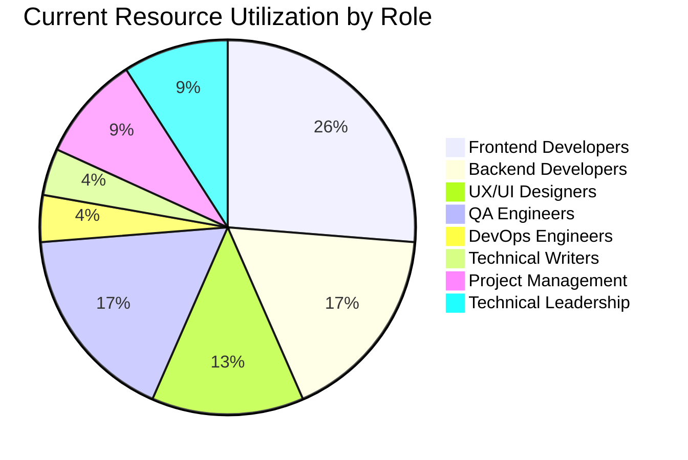

# Hypatia LMS Modernization: Resource Allocation Assessment

**Version:** 1.0  
**Last Updated:** 2023-08-17  
**Owner:** Project Manager

## Resource Allocation Overview

This document assesses the allocation of resources across the Hypatia LMS modernization project, identifies potential gaps or overallocations, and provides recommendations for optimization. Effective resource allocation is critical for meeting project timelines and delivering high-quality results.

## Current Team Composition

| Role | Allocated FTEs | Required FTEs | Gap | Notes |
|------|----------------|---------------|-----|-------|
| Project Manager | 1.0 | 1.0 | 0.0 | Sufficient allocation |
| Technical Lead | 1.0 | 1.0 | 0.0 | Sufficient allocation |
| Frontend Developers | 3.0 | 4.0 | -1.0 | Shortage for upcoming milestones |
| Backend Developers | 2.0 | 2.0 | 0.0 | Sufficient allocation |
| UX/UI Designers | 1.5 | 2.0 | -0.5 | Partial shortage |
| QA Engineers | 2.0 | 2.5 | -0.5 | Partial shortage |
| DevOps Engineers | 0.5 | 1.0 | -0.5 | Partial shortage |
| Technical Writers | 0.5 | 1.0 | -0.5 | Partial shortage |
| **Total** | **11.5** | **14.5** | **-3.0** | **Overall resource gap** |

## Resource Allocation by Milestone

| Milestone | Status | Planned Resources (person-weeks) | Actual Resources (person-weeks) | Variance | Efficiency |
|-----------|--------|----------------------------------|--------------------------------|----------|------------|
| Authentication System | Complete | 24 | 22 | -2 | 109% |
| Dashboard Modernization | Complete | 30 | 28 | -2 | 107% |
| Course Detail Pages | Complete | 36 | 40 | +4 | 90% |
| Activity Detail Pages | Complete | 30 | 32 | +2 | 94% |
| Course Editor | Complete | 40 | 38 | -2 | 105% |
| Grading System | Complete | 20 | 19 | -1 | 105% |
| Discussion Forums | Not Started | 30 | - | - | - |
| Notification System | Not Started | 24 | - | - | - |
| User Profile Management | Not Started | 20 | - | - | - |
| Analytics Dashboard | Not Started | 30 | - | - | - |
| Mobile App | Not Started | 60 | - | - | - |

## Resource Utilization Analysis

### Current Resource Utilization

### Resource Allocation by Skill Set

| Skill Set | Current Allocation | Required Allocation | Gap | Risk Level |
|-----------|-------------------|---------------------|-----|------------|
| React Development | High | High | Low | Low |
| TypeScript | Medium | High | Medium | Medium |
| Redux | Medium | High | Medium | Medium |
| Firebase | Medium | High | Medium | Medium |
| UI/UX Design | Medium | High | Medium | Medium |
| Automated Testing | Medium | High | Medium | Medium |
| Performance Optimization | Low | Medium | High | High |
| Accessibility | Low | Medium | High | High |
| Mobile Development | None | High | High | High |
| Analytics | Low | Medium | High | High |

## Resource Constraints and Bottlenecks

| Constraint/Bottleneck | Impact | Severity | Mitigation Strategy |
|-----------------------|--------|----------|---------------------|
| Frontend Developer shortage | Delayed implementation of upcoming features | High | Contract additional developers, prioritize features |
| UX/UI Designer partial shortage | Reduced design quality or delayed designs | Medium | Focus designer time on critical components, use design system |
| TypeScript expertise | Slower development, potential quality issues | Medium | Provide training, pair programming |
| QA Engineer partial shortage | Reduced test coverage, potential quality issues | Medium | Automate more tests, prioritize critical testing |
| Performance optimization expertise | Potential performance issues in production | Medium | External consultant, dedicated performance sprints |
| Accessibility expertise | Potential accessibility issues | Medium | Training, accessibility audit tools |
| Mobile development expertise | Delayed or lower quality mobile app | High | Early hiring or contracting for mobile expertise |

## Resource Allocation Recommendations

### Short-Term Recommendations (Next 30 Days)

1. **Contract 1 additional Frontend Developer** for the Discussion Forums milestone
   - Estimated cost: $15,000
   - Expected impact: Meet timeline for Discussion Forums milestone
   - Implementation timeline: 2 weeks for onboarding

2. **Increase UX/UI Designer allocation** to full-time (from 0.5 FTE to 1.0 FTE)
   - Estimated cost: $8,000
   - Expected impact: Improved design quality and timeliness
   - Implementation timeline: Immediate

3. **Provide TypeScript and Redux training** for development team
   - Estimated cost: $5,000
   - Expected impact: Improved development efficiency and code quality
   - Implementation timeline: 2 weeks

4. **Implement automated testing tools** to offset QA Engineer shortage
   - Estimated cost: $3,000
   - Expected impact: Maintained test coverage with fewer resources
   - Implementation timeline: 3 weeks

### Medium-Term Recommendations (Next 90 Days)

1. **Hire 1 permanent Frontend Developer** with mobile expertise
   - Estimated cost: $40,000 (quarterly)
   - Expected impact: Sustainable resource level for frontend development
   - Implementation timeline: 6 weeks for hiring and onboarding

2. **Contract accessibility consultant** for audit and recommendations
   - Estimated cost: $10,000
   - Expected impact: Improved accessibility compliance
   - Implementation timeline: 4 weeks

3. **Increase Technical Writer allocation** to full-time
   - Estimated cost: $12,000
   - Expected impact: Improved documentation quality and completeness
   - Implementation timeline: 4 weeks

4. **Provide performance optimization training** for development team
   - Estimated cost: $8,000
   - Expected impact: Improved application performance
   - Implementation timeline: 6 weeks

### Long-Term Recommendations (Next 180 Days)

1. **Hire dedicated Mobile Developer** for Mobile App milestone
   - Estimated cost: $40,000 (quarterly)
   - Expected impact: Successful delivery of Mobile App milestone
   - Implementation timeline: 8 weeks before Mobile App milestone

2. **Develop internal expertise** in analytics and data visualization
   - Estimated cost: $15,000 (training and tools)
   - Expected impact: Successful delivery of Analytics Dashboard milestone
   - Implementation timeline: 12 weeks

3. **Implement resource forecasting and capacity planning** process
   - Estimated cost: $5,000 (tools and process development)
   - Expected impact: Improved resource allocation and planning
   - Implementation timeline: 8 weeks

## Resource Allocation Optimization Strategies

### Knowledge Sharing and Cross-Training

| Skill Area | Primary Resource | Cross-Training Target | Status | Completion Target |
|------------|------------------|----------------------|--------|-------------------|
| React Development | Frontend Team | Backend Team | In Progress | 2023-09-15 |
| TypeScript | Technical Lead | All Developers | In Progress | 2023-09-30 |
| Firebase | Backend Team | Frontend Team | Planned | 2023-10-15 |
| Automated Testing | QA Team | All Developers | Planned | 2023-10-30 |
| UX Principles | Design Team | Frontend Team | Planned | 2023-11-15 |

### Process Improvements

1. **Implement component library** to reduce duplicate development effort
   - Status: In Progress
   - Expected completion: 2023-09-30
   - Expected impact: 20% reduction in UI development time

2. **Enhance automated testing framework** to reduce manual testing needs
   - Status: Planned
   - Expected completion: 2023-10-30
   - Expected impact: 30% reduction in QA time for regression testing

3. **Implement design system** to streamline design-to-development workflow
   - Status: In Progress
   - Expected completion: 2023-09-15
   - Expected impact: 25% reduction in design-to-implementation time

4. **Adopt pair programming** for knowledge sharing and quality improvement
   - Status: Implemented
   - Completion date: 2023-08-01
   - Observed impact: 15% improvement in code quality

## Resource Allocation Risks

| Risk | Probability | Impact | Risk Score | Mitigation Strategy |
|------|------------|--------|------------|---------------------|
| Unable to hire additional Frontend Developer | Medium | High | 6 | Engage with multiple recruiting channels, consider remote options |
| Team burnout from resource constraints | Medium | High | 6 | Monitor workload, adjust scope, provide support resources |
| Knowledge silos due to specialized expertise | Medium | Medium | 4 | Implement knowledge sharing sessions, documentation requirements |
| Contractor integration challenges | Medium | Medium | 4 | Clear onboarding process, pair with existing team members |
| Budget constraints for additional resources | High | High | 9 | Prioritize critical resources, explore internal reallocation |

## Conclusion and Next Steps

The Hypatia LMS modernization project currently faces a resource gap of approximately 3.0 FTEs, primarily in frontend development, UX/UI design, QA, and technical documentation. This gap presents a significant risk to the project timeline, particularly for upcoming milestones.

### Immediate Actions

1. Initiate contracting process for additional Frontend Developer
2. Increase UX/UI Designer allocation to full-time
3. Schedule TypeScript and Redux training sessions
4. Evaluate automated testing tools for implementation

### Monitoring and Review

1. Weekly resource utilization review in project status meetings
2. Monthly resource forecast update based on project progress
3. Quarterly comprehensive resource allocation assessment
4. Continuous monitoring of resource-related risks

### Long-Term Planning

1. Develop resource plan for Mobile App milestone
2. Establish sustainable resource model for ongoing maintenance
3. Build internal expertise in critical skill areas
4. Implement improved resource forecasting and capacity planning
