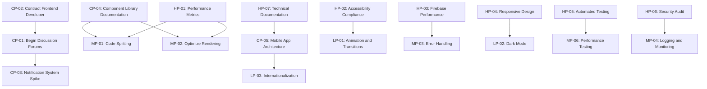

# Hypatia LMS Modernization: Prioritized Action Items

**Version:** 1.0  
**Last Updated:** 2023-08-17  
**Owner:** Project Manager

## Action Items Overview

This document outlines the prioritized action items for the Hypatia LMS modernization project. It provides a comprehensive list of tasks, their priorities, owners, due dates, and current status. The action items are derived from milestone reviews, gap analysis, progress tracking, and stakeholder feedback.

## Critical Path Action Items

These action items are on the critical path and directly impact the project timeline. Any delay in these items will affect the overall project completion date.

| ID | Action Item | Priority | Owner | Due Date | Status | Dependencies | Success Criteria |
|----|------------|----------|-------|----------|--------|--------------|------------------|
| CP-01 | Begin Discussion Forums milestone | Critical | Technical Lead | 2023-08-25 | Not Started | None | Development environment set up, initial components created |
| CP-02 | Contract additional Frontend Developer | Critical | Project Manager | 2023-08-31 | In Progress | Budget approval | Developer onboarded and productive |
| CP-03 | Conduct technical spike for Notification System | Critical | Backend Lead | 2023-09-15 | Not Started | None | Technical approach documented, potential challenges identified |
| CP-04 | Develop component library documentation | Critical | Frontend Lead | 2023-09-30 | Not Started | None | Comprehensive documentation of reusable components |
| CP-05 | Plan Mobile App architecture | Critical | Technical Lead | 2023-10-15 | Not Started | None | Architecture document approved by stakeholders |

## High Priority Action Items

These action items are not on the critical path but are essential for project success and quality.

| ID | Action Item | Priority | Owner | Due Date | Status | Dependencies | Success Criteria |
|----|------------|----------|-------|----------|--------|--------------|------------------|
| HP-01 | Address performance metrics | High | Technical Lead | 2023-09-15 | Not Started | None | Bundle size reduced to <2.0MB, load time reduced to <3.0s |
| HP-02 | Improve accessibility compliance | High | UX Lead | 2023-09-30 | Not Started | None | Accessibility compliance increased to >90% |
| HP-03 | Optimize Firebase performance | High | Backend Lead | 2023-10-15 | Not Started | None | Query response time reduced by 30% |
| HP-04 | Enhance responsive design | High | Frontend Lead | 2023-10-30 | Not Started | None | Responsive design compliance increased to >95% |
| HP-05 | Implement automated testing framework | High | QA Lead | 2023-09-30 | Not Started | None | 50% reduction in manual testing time |
| HP-06 | Conduct security audit | High | Security Lead | 2023-09-15 | Not Started | None | No critical or high security vulnerabilities |
| HP-07 | Update technical documentation | High | Technical Writer | 2023-09-30 | Not Started | None | Documentation updated for all completed milestones |

## Medium Priority Action Items

These action items are important for project quality and efficiency but have less immediate impact.

| ID | Action Item | Priority | Owner | Due Date | Status | Dependencies | Success Criteria |
|----|------------|----------|-------|----------|--------|--------------|------------------|
| MP-01 | Implement code splitting | Medium | Frontend Lead | 2023-10-15 | Not Started | None | Bundle size reduced by 20% |
| MP-02 | Optimize component rendering | Medium | Frontend Lead | 2023-10-30 | Not Started | None | Render time reduced by 25% |
| MP-03 | Enhance error handling | Medium | Backend Lead | 2023-10-15 | Not Started | None | Comprehensive error handling implemented |
| MP-04 | Improve logging and monitoring | Medium | DevOps Lead | 2023-10-30 | Not Started | None | Comprehensive logging and monitoring implemented |
| MP-05 | Refine user onboarding flow | Medium | UX Lead | 2023-11-15 | Not Started | None | User onboarding time reduced by 30% |
| MP-06 | Implement performance testing | Medium | QA Lead | 2023-11-30 | Not Started | None | Performance testing automated and integrated into CI/CD |
| MP-07 | Enhance data visualization components | Medium | Frontend Lead | 2023-12-15 | Not Started | None | Reusable data visualization components implemented |

## Low Priority Action Items

These action items are beneficial but not critical for project success.

| ID | Action Item | Priority | Owner | Due Date | Status | Dependencies | Success Criteria |
|----|------------|----------|-------|----------|--------|--------------|------------------|
| LP-01 | Refine animation and transitions | Low | UX Lead | 2023-12-31 | Not Started | None | Consistent animations and transitions implemented |
| LP-02 | Implement dark mode | Low | Frontend Lead | 2024-01-15 | Not Started | None | Dark mode implemented and tested |
| LP-03 | Enhance internationalization | Low | Frontend Lead | 2024-01-31 | Not Started | None | Internationalization framework implemented |
| LP-04 | Optimize image loading | Low | Frontend Lead | 2023-12-15 | Not Started | None | Image loading time reduced by 30% |
| LP-05 | Implement advanced search features | Low | Backend Lead | 2024-01-15 | Not Started | None | Advanced search features implemented |

## Action Items by Category

### Performance Optimization

| ID | Action Item | Priority | Owner | Due Date | Status |
|----|------------|----------|-------|----------|--------|
| HP-01 | Address performance metrics | High | Technical Lead | 2023-09-15 | Not Started |
| HP-03 | Optimize Firebase performance | High | Backend Lead | 2023-10-15 | Not Started |
| MP-01 | Implement code splitting | Medium | Frontend Lead | 2023-10-15 | Not Started |
| MP-02 | Optimize component rendering | Medium | Frontend Lead | 2023-10-30 | Not Started |
| LP-04 | Optimize image loading | Low | Frontend Lead | 2023-12-15 | Not Started |

### User Experience

| ID | Action Item | Priority | Owner | Due Date | Status |
|----|------------|----------|-------|----------|--------|
| HP-02 | Improve accessibility compliance | High | UX Lead | 2023-09-30 | Not Started |
| HP-04 | Enhance responsive design | High | Frontend Lead | 2023-10-30 | Not Started |
| MP-05 | Refine user onboarding flow | Medium | UX Lead | 2023-11-15 | Not Started |
| LP-01 | Refine animation and transitions | Low | UX Lead | 2023-12-31 | Not Started |
| LP-02 | Implement dark mode | Low | Frontend Lead | 2024-01-15 | Not Started |

### Technical Debt

| ID | Action Item | Priority | Owner | Due Date | Status |
|----|------------|----------|-------|----------|--------|
| CP-04 | Develop component library documentation | Critical | Frontend Lead | 2023-09-30 | Not Started |
| HP-07 | Update technical documentation | High | Technical Writer | 2023-09-30 | Not Started |
| MP-03 | Enhance error handling | Medium | Backend Lead | 2023-10-15 | Not Started |
| MP-04 | Improve logging and monitoring | Medium | DevOps Lead | 2023-10-30 | Not Started |

### Quality Assurance

| ID | Action Item | Priority | Owner | Due Date | Status |
|----|------------|----------|-------|----------|--------|
| HP-05 | Implement automated testing framework | High | QA Lead | 2023-09-30 | Not Started |
| HP-06 | Conduct security audit | High | Security Lead | 2023-09-15 | Not Started |
| MP-06 | Implement performance testing | Medium | QA Lead | 2023-11-30 | Not Started |

## Action Items by Owner

### Technical Lead

| ID | Action Item | Priority | Due Date | Status |
|----|------------|----------|----------|--------|
| CP-01 | Begin Discussion Forums milestone | Critical | 2023-08-25 | Not Started |
| CP-05 | Plan Mobile App architecture | Critical | 2023-10-15 | Not Started |
| HP-01 | Address performance metrics | High | 2023-09-15 | Not Started |

### Project Manager

| ID | Action Item | Priority | Due Date | Status |
|----|------------|----------|----------|--------|
| CP-02 | Contract additional Frontend Developer | Critical | 2023-08-31 | In Progress |

### Frontend Lead

| ID | Action Item | Priority | Due Date | Status |
|----|------------|----------|----------|--------|
| CP-04 | Develop component library documentation | Critical | 2023-09-30 | Not Started |
| HP-04 | Enhance responsive design | High | 2023-10-30 | Not Started |
| MP-01 | Implement code splitting | Medium | 2023-10-15 | Not Started |
| MP-02 | Optimize component rendering | Medium | 2023-10-30 | Not Started |
| MP-07 | Enhance data visualization components | Medium | 2023-12-15 | Not Started |
| LP-02 | Implement dark mode | Low | 2024-01-15 | Not Started |
| LP-03 | Enhance internationalization | Low | 2024-01-31 | Not Started |
| LP-04 | Optimize image loading | Low | 2023-12-15 | Not Started |

### Backend Lead

| ID | Action Item | Priority | Due Date | Status |
|----|------------|----------|----------|--------|
| CP-03 | Conduct technical spike for Notification System | Critical | 2023-09-15 | Not Started |
| HP-03 | Optimize Firebase performance | High | 2023-10-15 | Not Started |
| MP-03 | Enhance error handling | Medium | 2023-10-15 | Not Started |
| LP-05 | Implement advanced search features | Low | 2024-01-15 | Not Started |

### UX Lead

| ID | Action Item | Priority | Due Date | Status |
|----|------------|----------|----------|--------|
| HP-02 | Improve accessibility compliance | High | 2023-09-30 | Not Started |
| MP-05 | Refine user onboarding flow | Medium | 2023-11-15 | Not Started |
| LP-01 | Refine animation and transitions | Low | 2023-12-31 | Not Started |

### QA Lead

| ID | Action Item | Priority | Due Date | Status |
|----|------------|----------|----------|--------|
| HP-05 | Implement automated testing framework | High | 2023-09-30 | Not Started |
| MP-06 | Implement performance testing | Medium | 2023-11-30 | Not Started |

### Other Owners

| ID | Action Item | Priority | Owner | Due Date | Status |
|----|------------|----------|-------|----------|--------|
| HP-06 | Conduct security audit | High | Security Lead | 2023-09-15 | Not Started |
| HP-07 | Update technical documentation | High | Technical Writer | 2023-09-30 | Not Started |
| MP-04 | Improve logging and monitoring | Medium | DevOps Lead | 2023-10-30 | Not Started |

## Action Item Dependencies

## Contingency Plans for Critical Path Items

| ID | Action Item | Risk | Contingency Plan |
|----|------------|------|------------------|
| CP-01 | Begin Discussion Forums milestone | Resource availability | Reallocate resources from non-critical tasks, adjust scope |
| CP-02 | Contract additional Frontend Developer | Hiring challenges | Engage with multiple recruiting channels, consider remote options |
| CP-03 | Conduct technical spike for Notification System | Technical complexity | Allocate additional time, engage external expertise if needed |
| CP-04 | Develop component library documentation | Resource constraints | Prioritize critical components, phase documentation effort |
| CP-05 | Plan Mobile App architecture | Knowledge gaps | Engage external consultant, conduct training sessions |

## Action Item Tracking Process

1. **Weekly Review**
   - Review action item status in weekly project meetings
   - Update status and identify blockers
   - Adjust priorities and due dates as needed

2. **Monthly Assessment**
   - Comprehensive review of all action items
   - Evaluate impact on project timeline and quality
   - Identify new action items based on project progress

3. **Quarterly Planning**
   - Strategic review of action items
   - Align with project goals and milestones
   - Adjust resource allocation as needed

## Next Steps

1. Communicate action items to respective owners
2. Establish tracking mechanism in project management tool
3. Begin weekly review process
4. Prioritize critical path items for immediate action

## Appendix: Action Item Status Definitions

- **Not Started**: Action item has been identified but work has not begun
- **In Progress**: Work on the action item has started but is not complete
- **Blocked**: Action item cannot proceed due to dependencies or issues
- **Completed**: Action item has been successfully completed
- **Deferred**: Action item has been postponed to a later date
- **Cancelled**: Action item is no longer required or relevant
