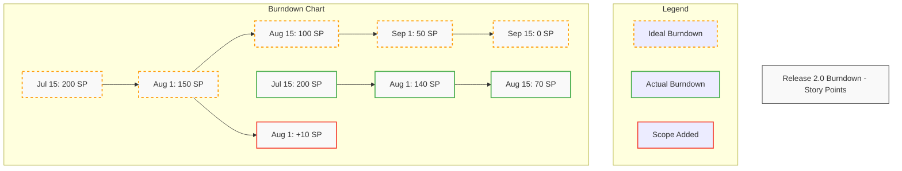
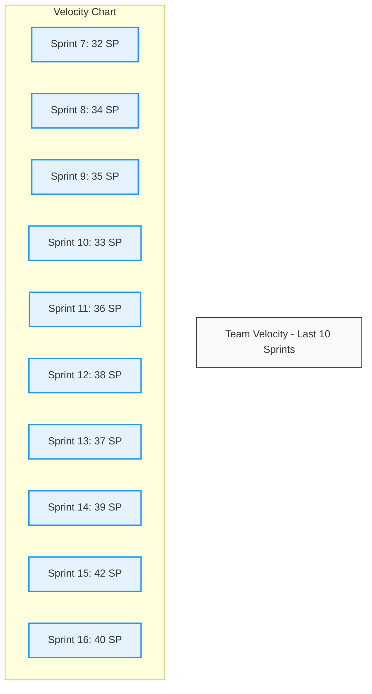
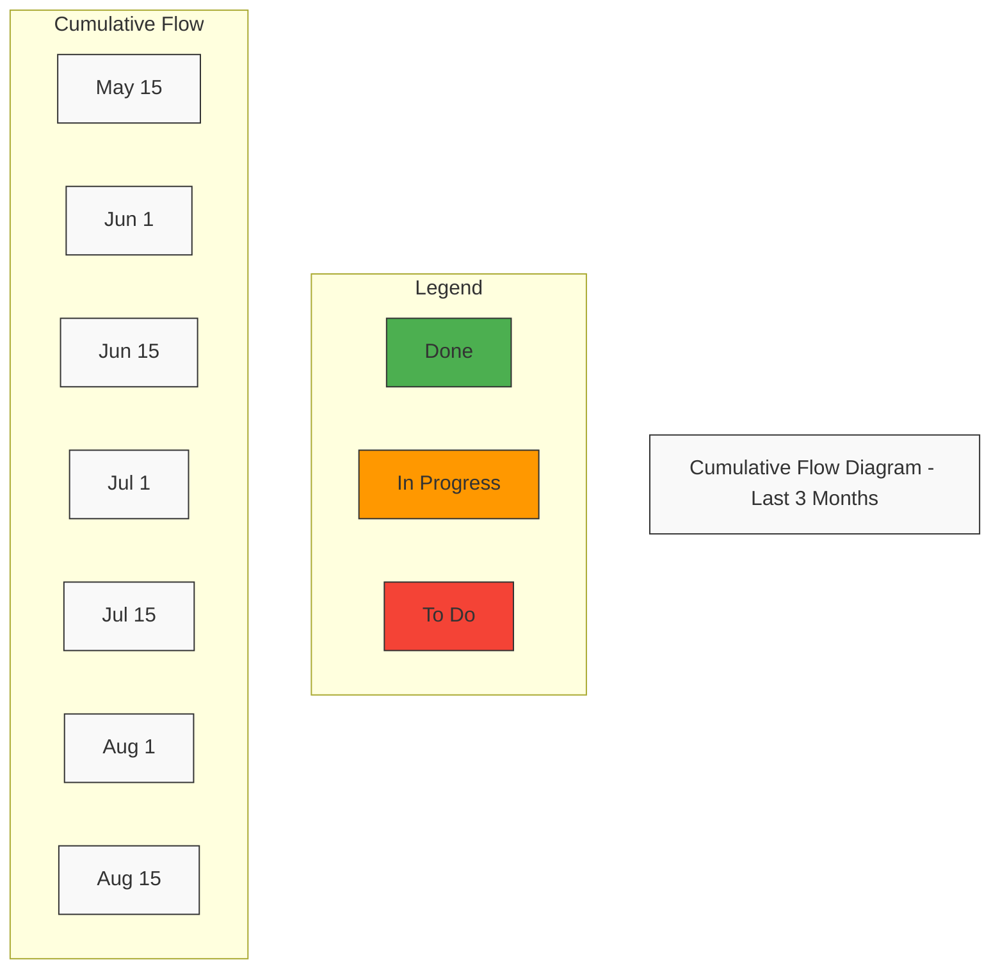

# Hypatia LMS Modernization: Burndown Charts

**Version:** 1.0  
**Last Updated:** 2023-08-17  
**Owner:** Project Manager

## Burndown Charts Overview

This document presents burndown charts for the Hypatia LMS modernization project, tracking progress at both the sprint and release levels. Burndown charts provide a visual representation of work completed versus work remaining, helping to identify trends, forecast completion dates, and highlight potential issues.

## Project-Level Burndown

The project-level burndown chart tracks progress across the entire project, showing the completion of story points or features over time.

```mermaid
graph TD
    title[Project Burndown - Story Points]
    style title fill:#f9f9f9,stroke:#333,stroke-width:1px
    
    subgraph legend[Legend]
        ideal[Ideal Burndown]
        style ideal stroke:#ff9800,stroke-width:2px,stroke-dasharray: 5 5
        actual[Actual Burndown]
        style actual stroke:#4caf50,stroke-width:2px
        forecast[Forecast]
        style forecast stroke:#2196f3,stroke-width:2px,stroke-dasharray: 5 5
    end
    
    subgraph chart[Burndown Chart]
        may1[May 1: 1000 SP]
        jun1[Jun 1: 850 SP]
        jul1[Jul 1: 680 SP]
        aug1[Aug 1: 480 SP]
        sep1[Sep 1: 320 SP]
        oct1[Oct 1: 200 SP]
        nov1[Nov 1: 100 SP]
        dec1[Dec 1: 0 SP]
        
        may1a[May 1: 1000 SP]
        jun1a[Jun 1: 830 SP]
        jul1a[Jul 1: 650 SP]
        aug1a[Aug 1: 420 SP]
        aug15a[Aug 15: 300 SP]
        
        aug15f[Aug 15: 300 SP]
        sep1f[Sep 1: 220 SP]
        oct1f[Oct 1: 100 SP]
        nov1f[Nov 1: 0 SP]
        
        %% Ideal burndown
        may1 --> jun1
        jun1 --> jul1
        jul1 --> aug1
        aug1 --> sep1
        sep1 --> oct1
        oct1 --> nov1
        nov1 --> dec1
        
        %% Actual burndown
        may1a --> jun1a
        jun1a --> jul1a
        jul1a --> aug1a
        aug1a --> aug15a
        
        %% Forecast
        aug15f --> sep1f
        sep1f --> oct1f
        oct1f --> nov1f
        
        %% Styling
        style may1 fill:#f9f9f9,stroke:#ff9800,stroke-width:2px,stroke-dasharray: 5 5
        style jun1 fill:#f9f9f9,stroke:#ff9800,stroke-width:2px,stroke-dasharray: 5 5
        style jul1 fill:#f9f9f9,stroke:#ff9800,stroke-width:2px,stroke-dasharray: 5 5
        style aug1 fill:#f9f9f9,stroke:#ff9800,stroke-width:2px,stroke-dasharray: 5 5
        style sep1 fill:#f9f9f9,stroke:#ff9800,stroke-width:2px,stroke-dasharray: 5 5
        style oct1 fill:#f9f9f9,stroke:#ff9800,stroke-width:2px,stroke-dasharray: 5 5
        style nov1 fill:#f9f9f9,stroke:#ff9800,stroke-width:2px,stroke-dasharray: 5 5
        style dec1 fill:#f9f9f9,stroke:#ff9800,stroke-width:2px,stroke-dasharray: 5 5
        
        style may1a fill:#f9f9f9,stroke:#4caf50,stroke-width:2px
        style jun1a fill:#f9f9f9,stroke:#4caf50,stroke-width:2px
        style jul1a fill:#f9f9f9,stroke:#4caf50,stroke-width:2px
        style aug1a fill:#f9f9f9,stroke:#4caf50,stroke-width:2px
        style aug15a fill:#f9f9f9,stroke:#4caf50,stroke-width:2px
        
        style aug15f fill:#f9f9f9,stroke:#2196f3,stroke-width:2px,stroke-dasharray: 5 5
        style sep1f fill:#f9f9f9,stroke:#2196f3,stroke-width:2px,stroke-dasharray: 5 5
        style oct1f fill:#f9f9f9,stroke:#2196f3,stroke-width:2px,stroke-dasharray: 5 5
        style nov1f fill:#f9f9f9,stroke:#2196f3,stroke-width:2px,stroke-dasharray: 5 5
    end
```

### Project Burndown Analysis

| Metric | Value | Interpretation |
|--------|-------|----------------|
| Total Story Points | 1000 | Total scope of the project |
| Completed Story Points | 700 | Work completed to date (70%) |
| Remaining Story Points | 300 | Work remaining (30%) |
| Original End Date | 2023-12-01 | Initial project completion target |
| Forecasted End Date | 2023-11-01 | Current forecast based on velocity |
| Schedule Variance | -30 days | Project is ahead of schedule |
| Velocity (Avg) | 140 SP/month | Average story points completed per month |
| Velocity (Last 3 months) | 160 SP/month | Recent velocity shows acceleration |
| Scope Change | +50 SP | Additional scope added since project start |

### Project Burndown Trends

1. **Ahead of Schedule**: The project is consistently ahead of the ideal burndown line, indicating faster progress than initially planned.
2. **Acceleration**: The velocity has increased in recent months, from 140 SP/month to 160 SP/month.
3. **Forecast Improvement**: The forecasted completion date has moved from December 1, 2023 to November 1, 2023.
4. **Scope Management**: Despite adding 50 story points of scope, the project remains ahead of schedule.

## Release Burndown

The release burndown chart tracks progress for the current release, showing the completion of story points or features within the release timeframe.

### Release Burndown Analysis

| Metric | Value | Interpretation |
|--------|-------|----------------|
| Release | 2.0 | Current release |
| Release Scope | 200 SP | Initial scope of the release |
| Completed Story Points | 130 SP | Work completed to date (65%) |
| Remaining Story Points | 70 SP | Work remaining (35%) |
| Scope Changes | +10 SP | Additional scope added during release |
| Original End Date | 2023-09-15 | Initial release target |
| Forecasted End Date | 2023-09-01 | Current forecast based on velocity |
| Schedule Variance | -14 days | Release is ahead of schedule |
| Velocity (Avg) | 65 SP/month | Average story points completed per month |

### Release Burndown Trends

1. **Ahead of Schedule**: The release is ahead of the ideal burndown line, indicating faster progress than initially planned.
2. **Scope Management**: A small amount of scope (10 SP) was added during the release, but this has been absorbed without affecting the timeline.
3. **Forecast Improvement**: The forecasted completion date has moved from September 15, 2023 to September 1, 2023.

## Sprint Burndown

The sprint burndown chart tracks progress within the current sprint, showing the completion of story points or tasks on a daily basis.

```mermaid
graph TD
    title[Sprint 16 Burndown - Story Points]
    style title fill:#f9f9f9,stroke:#333,stroke-width:1px
    
    subgraph legend[Legend]
        ideal[Ideal Burndown]
        style ideal stroke:#ff9800,stroke-width:2px,stroke-dasharray: 5 5
        actual[Actual Burndown]
        style actual stroke:#4caf50,stroke-width:2px
    end
    
    subgraph chart[Burndown Chart]
        day1[Day 1: 40 SP]
        day2[Day 2: 35 SP]
        day3[Day 3: 30 SP]
        day4[Day 4: 25 SP]
        day5[Day 5: 20 SP]
        day6[Day 6: 15 SP]
        day7[Day 7: 10 SP]
        day8[Day 8: 5 SP]
        day9[Day 9: 0 SP]
        day10[Day 10: 0 SP]
        
        day1a[Day 1: 40 SP]
        day2a[Day 2: 38 SP]
        day3a[Day 3: 32 SP]
        day4a[Day 4: 28 SP]
        day5a[Day 5: 20 SP]
        day6a[Day 6: 15 SP]
        day7a[Day 7: 8 SP]
        day8a[Day 8: 2 SP]
        day9a[Day 9: 0 SP]
        
        %% Ideal burndown
        day1 --> day2
        day2 --> day3
        day3 --> day4
        day4 --> day5
        day5 --> day6
        day6 --> day7
        day7 --> day8
        day8 --> day9
        day9 --> day10
        
        %% Actual burndown
        day1a --> day2a
        day2a --> day3a
        day3a --> day4a
        day4a --> day5a
        day5a --> day6a
        day6a --> day7a
        day7a --> day8a
        day8a --> day9a
        
        %% Styling
        style day1 fill:#f9f9f9,stroke:#ff9800,stroke-width:2px,stroke-dasharray: 5 5
        style day2 fill:#f9f9f9,stroke:#ff9800,stroke-width:2px,stroke-dasharray: 5 5
        style day3 fill:#f9f9f9,stroke:#ff9800,stroke-width:2px,stroke-dasharray: 5 5
        style day4 fill:#f9f9f9,stroke:#ff9800,stroke-width:2px,stroke-dasharray: 5 5
        style day5 fill:#f9f9f9,stroke:#ff9800,stroke-width:2px,stroke-dasharray: 5 5
        style day6 fill:#f9f9f9,stroke:#ff9800,stroke-width:2px,stroke-dasharray: 5 5
        style day7 fill:#f9f9f9,stroke:#ff9800,stroke-width:2px,stroke-dasharray: 5 5
        style day8 fill:#f9f9f9,stroke:#ff9800,stroke-width:2px,stroke-dasharray: 5 5
        style day9 fill:#f9f9f9,stroke:#ff9800,stroke-width:2px,stroke-dasharray: 5 5
        style day10 fill:#f9f9f9,stroke:#ff9800,stroke-width:2px,stroke-dasharray: 5 5
        
        style day1a fill:#f9f9f9,stroke:#4caf50,stroke-width:2px
        style day2a fill:#f9f9f9,stroke:#4caf50,stroke-width:2px
        style day3a fill:#f9f9f9,stroke:#4caf50,stroke-width:2px
        style day4a fill:#f9f9f9,stroke:#4caf50,stroke-width:2px
        style day5a fill:#f9f9f9,stroke:#4caf50,stroke-width:2px
        style day6a fill:#f9f9f9,stroke:#4caf50,stroke-width:2px
        style day7a fill:#f9f9f9,stroke:#4caf50,stroke-width:2px
        style day8a fill:#f9f9f9,stroke:#4caf50,stroke-width:2px
        style day9a fill:#f9f9f9,stroke:#4caf50,stroke-width:2px
    end
```

### Sprint Burndown Analysis

| Metric | Value | Interpretation |
|--------|-------|----------------|
| Sprint | 16 | Current sprint |
| Sprint Goal | Grading System Completion | Primary objective of the sprint |
| Sprint Scope | 40 SP | Total story points committed |
| Completed Story Points | 40 SP | Work completed (100%) |
| Original End Date | 2023-08-18 | Initial sprint end date |
| Actual End Date | 2023-08-17 | Actual completion date |
| Schedule Variance | -1 day | Sprint completed ahead of schedule |
| Daily Velocity (Avg) | 4.4 SP/day | Average story points completed per day |

### Sprint Burndown Trends

1. **Slow Start**: The sprint started slightly behind the ideal burndown line in the first few days.
2. **Mid-Sprint Acceleration**: The team caught up to the ideal line by day 5.
3. **Strong Finish**: The sprint finished one day ahead of schedule with all story points completed.
4. **Consistent Progress**: After the initial slow start, the team maintained a consistent pace throughout the sprint.

## Velocity Trends

The velocity chart shows the team's velocity (story points completed) over the past 10 sprints, helping to identify trends and forecast future capacity.

### Velocity Analysis

| Metric | Value | Interpretation |
|--------|-------|----------------|
| Average Velocity | 36.6 SP/sprint | Average story points completed per sprint |
| Median Velocity | 36.5 SP/sprint | Median story points completed per sprint |
| Velocity Range | 32-42 SP/sprint | Range of story points completed per sprint |
| Velocity Trend | Increasing | Velocity has increased over time |
| Last 3 Sprints Avg | 40.3 SP/sprint | Recent velocity is higher than overall average |
| Velocity Stability | High | Consistent velocity with low variance |
| Commitment Reliability | 95% | Percentage of committed story points completed |

### Velocity Trends

1. **Increasing Trend**: The team's velocity has shown a gradual increase over the past 10 sprints.
2. **Recent Stability**: The last 3 sprints show a stabilization around 40 SP/sprint.
3. **Predictability**: The team's velocity has become more predictable, with less variance in recent sprints.
4. **Capacity Improvement**: The team's capacity has increased by approximately 25% since Sprint 7.

## Cumulative Flow Diagram

The cumulative flow diagram shows the status of work items over time, helping to identify bottlenecks and flow issues.

### Cumulative Flow Analysis

| Metric | Value | Interpretation |
|--------|-------|----------------|
| Work in Progress (Avg) | 35 SP | Average amount of work in progress |
| Work in Progress (Current) | 30 SP | Current amount of work in progress |
| Cycle Time (Avg) | 5.2 days | Average time from start to completion |
| Throughput (Avg) | 7.5 SP/day | Average story points completed per day |
| Backlog Growth | -150 SP | Change in backlog size over period |
| Bottleneck Areas | None | No significant bottlenecks identified |
| Flow Efficiency | 75% | Percentage of time items are actively worked on |

### Cumulative Flow Trends

1. **Stable Work in Progress**: The amount of work in progress has remained relatively stable, indicating good flow control.
2. **Decreasing Backlog**: The backlog has decreased over time, indicating good progress against the overall scope.
3. **Consistent Throughput**: The throughput has remained consistent, with a slight increase in recent weeks.
4. **No Bottlenecks**: There are no significant bottlenecks or stagnation points in the workflow.

## Burndown Metrics Summary

| Level | Metric | Value | Status |
|-------|--------|-------|--------|
| Project | Completion Percentage | 70% | On Track |
| Project | Schedule Variance | -30 days | Ahead |
| Project | Scope Change | +50 SP | Managed |
| Release | Completion Percentage | 65% | On Track |
| Release | Schedule Variance | -14 days | Ahead |
| Release | Scope Change | +10 SP | Managed |
| Sprint | Completion Percentage | 100% | Complete |
| Sprint | Schedule Variance | -1 day | Ahead |
| Sprint | Commitment Reliability | 100% | On Target |
| Team | Velocity Trend | Increasing | Positive |
| Team | Velocity Stability | High | Positive |
| Team | Work in Progress | Stable | Positive |

## Recommendations Based on Burndown Analysis

### Short-Term Recommendations

1. **Maintain Current Velocity**: The team's velocity has stabilized at a good level. Maintain the current team composition and practices.
2. **Continue Scope Management**: The project has successfully managed scope changes. Continue the current scope management practices.
3. **Optimize Sprint Planning**: The team has been completing sprints ahead of schedule. Consider increasing sprint commitments slightly to optimize capacity.

### Medium-Term Recommendations

1. **Forecast Adjustment**: Based on the current velocity trend, adjust the project forecast to reflect the potential early completion.
2. **Resource Planning**: With the project ahead of schedule, begin planning for resource transitions to upcoming projects.
3. **Quality Focus**: With the schedule buffer, allocate more time to quality assurance and technical debt reduction.

### Long-Term Recommendations

1. **Process Improvement**: Document the successful practices that have led to the increasing velocity and stable flow.
2. **Capacity Planning**: Use the established velocity metrics for more accurate capacity planning in future projects.
3. **Team Structure**: Consider maintaining the current team structure for future projects given the demonstrated effectiveness.

## Conclusion

The burndown charts and related metrics indicate that the Hypatia LMS modernization project is progressing well, with the project, current release, and current sprint all ahead of schedule. The team's velocity has shown a positive trend, and work is flowing smoothly through the development process.

The project is currently forecasted to complete approximately one month ahead of the original schedule, providing a buffer for any unforeseen challenges or opportunities for additional scope. The team's performance has been consistent and reliable, with high commitment reliability and stable work in progress.

These positive indicators suggest that the current project management and development practices are effective and should be maintained. The recommendations provided aim to capitalize on the current momentum and ensure continued success through the remainder of the project.
