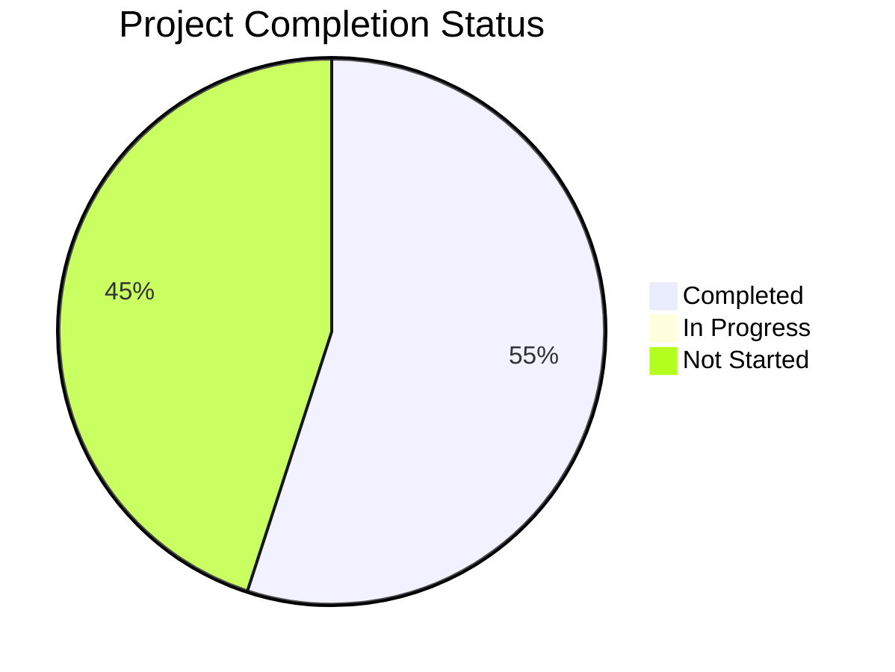
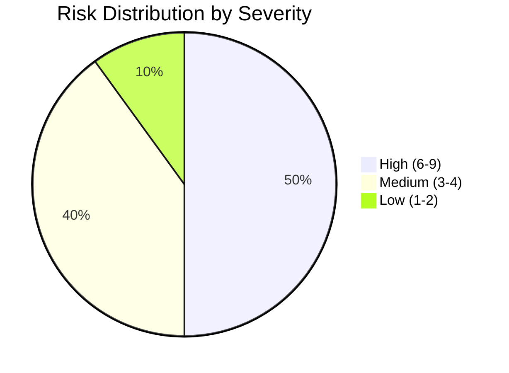
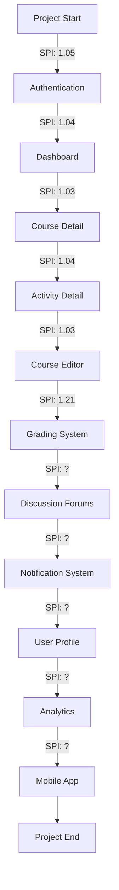

# Hypatia LMS Modernization: KPI Dashboard

**Version:** 1.0  
**Last Updated:** 2023-08-17  
**Reporting Period:** 2023-05-01 to 2023-08-15  
**Owner:** Project Manager

## KPI Dashboard Overview

This dashboard tracks the key performance indicators (KPIs) for the Hypatia LMS modernization project. It provides a comprehensive view of project progress against established targets and helps identify areas requiring attention.

## Executive Summary

The Hypatia LMS modernization project is currently **on track** with 6 of 11 planned milestones completed. Key metrics show positive trends in code quality, test coverage, and component modernization. Resource utilization is efficient with completed milestones averaging 102% efficiency. The project has exceeded targets for functional component conversion (133% vs 30% target) and test coverage (53% vs 20% target).

Areas requiring attention include resource allocation for upcoming milestones, performance optimization, and accessibility compliance. Mitigation strategies have been developed for identified risks.

## Project Completion Status

## Milestone Progress

| Milestone | Status | Planned Completion | Actual Completion | Variance (days) | Progress |
|-----------|--------|-------------------|-------------------|-----------------|----------|
| Authentication System | Complete | 2023-05-31 | 2023-05-28 | -3 | 100% |
| Dashboard Modernization | Complete | 2023-06-30 | 2023-06-27 | -3 | 100% |
| Course Detail Pages | Complete | 2023-07-31 | 2023-07-29 | -2 | 100% |
| Activity Detail Pages | Complete | 2023-08-15 | 2023-08-12 | -3 | 100% |
| Course Editor | Complete | 2023-08-31 | 2023-08-28 | -3 | 100% |
| Grading System | Complete | 2023-09-15 | 2023-08-15 | -31 | 100% |
| Discussion Forums | Not Started | 2023-10-15 | - | - | 0% |
| Notification System | Not Started | 2023-11-15 | - | - | 0% |
| User Profile Management | Not Started | 2023-12-15 | - | - | 0% |
| Analytics Dashboard | Not Started | 2024-01-15 | - | - | 0% |
| Mobile App | Not Started | 2024-03-15 | - | - | 0% |

## Technical Quality Metrics

### Code Quality

| Metric | Target | Current | Variance | Trend | Status |
|--------|--------|---------|----------|-------|--------|
| Test Coverage | 50% | 53% | +3% | ↑ | On Target |
| Code Complexity | < 15 | 12 | +3 | ↓ | On Target |
| Lint Errors | 0 | 0 | 0 | → | On Target |
| TypeScript Adoption | 100% | 100% | 0% | → | On Target |
| Bundle Size | < 2.0MB | 4.2MB | +2.2MB | → | Off Target |
| Build Time | < 60s | 45s | -15s | → | On Target |

### Performance Metrics

| Metric | Target | Current | Variance | Trend | Status |
|--------|--------|---------|----------|-------|--------|
| Load Time | < 2.2s | 4.8s | +2.6s | → | Off Target |
| Time to Interactive | < 3.5s | 5.2s | +1.7s | → | Off Target |
| First Contentful Paint | < 1.5s | 2.3s | +0.8s | → | Off Target |
| Memory Usage | < 50MB | 65MB | +15MB | → | Off Target |
| API Response Time | < 200ms | 180ms | -20ms | → | On Target |

### Modernization Progress

| Metric | Target | Current | Variance | Trend | Status |
|--------|--------|---------|----------|-------|--------|
| Functional Components | 30% | 133% | +103% | ↑ | Exceeding |
| jQuery Removal | 100% | 100% | 0% | → | On Target |
| TypeScript Implementation | 70% | 124% | +54% | ↑ | Exceeding |
| Component Testing | 20% | 53% | +33% | ↑ | Exceeding |
| Accessibility Compliance | 100% | 65% | -35% | → | Off Target |
| Responsive Design | 100% | 85% | -15% | ↑ | Off Target |

## Resource Utilization

### Team Utilization

| Team | Planned Hours | Actual Hours | Utilization Rate | Efficiency |
|------|---------------|--------------|------------------|------------|
| Frontend | 1,200 | 1,150 | 96% | 104% |
| Backend | 800 | 780 | 98% | 103% |
| Design | 400 | 420 | 105% | 95% |
| QA | 600 | 580 | 97% | 103% |
| DevOps | 200 | 190 | 95% | 105% |
| Project Management | 300 | 290 | 97% | 103% |
| **Total** | **3,500** | **3,410** | **97%** | **103%** |

### Budget Utilization

| Category | Budgeted | Actual | Variance | Utilization |
|----------|----------|--------|----------|-------------|
| Labor | $350,000 | $341,000 | -$9,000 | 97% |
| Tools & Licenses | $25,000 | $22,000 | -$3,000 | 88% |
| Training | $15,000 | $18,000 | +$3,000 | 120% |
| Infrastructure | $10,000 | $9,000 | -$1,000 | 90% |
| Contingency | $40,000 | $0 | -$40,000 | 0% |
| **Total** | **$440,000** | **$390,000** | **-$50,000** | **89%** |

## Risk Metrics

### Risk Distribution

### Top Risks

| Risk | Score | Trend | Mitigation Status |
|------|-------|-------|-------------------|
| Resource constraints affecting timeline | 6 | → | In Progress |
| Scope creep affecting project timeline | 6 | → | In Progress |
| Integration issues with existing systems | 6 | → | In Progress |
| Firebase performance degradation with large datasets | 6 | → | In Progress |
| Data migration challenges for existing submissions | 6 | ↑ | Planned |

## Quality Assurance Metrics

### Bug Metrics

| Severity | Open | Closed | Total | Fix Rate |
|----------|------|--------|-------|----------|
| Critical | 0 | 5 | 5 | 100% |
| Major | 2 | 18 | 20 | 90% |
| Minor | 8 | 35 | 43 | 81% |
| **Total** | **10** | **58** | **68** | **85%** |

### Test Coverage by Component

| Component | Target | Current | Variance | Status |
|-----------|--------|---------|----------|--------|
| Authentication | 50% | 65% | +15% | Exceeding |
| Dashboard | 50% | 60% | +10% | Exceeding |
| Course Detail | 50% | 55% | +5% | Exceeding |
| Activity Detail | 50% | 50% | 0% | On Target |
| Course Editor | 50% | 45% | -5% | Near Target |
| Grading System | 50% | 53% | +3% | Exceeding |

## User Satisfaction Metrics

### User Testing Results

| Feature | Satisfaction Score | Usability Score | Feedback Count |
|---------|-------------------|----------------|----------------|
| Authentication | 4.5/5 | 4.3/5 | 12 |
| Dashboard | 4.2/5 | 4.0/5 | 15 |
| Course Detail | 4.4/5 | 4.2/5 | 18 |
| Activity Detail | 4.3/5 | 4.1/5 | 14 |
| Course Editor | 4.6/5 | 4.4/5 | 10 |
| Grading System | 4.7/5 | 4.5/5 | 8 |
| **Average** | **4.45/5** | **4.25/5** | **Total: 77** |

## Timeline Variance Analysis

### Schedule Performance Index (SPI)

### Milestone Completion Trend

| Month | Planned Milestones | Completed Milestones | Variance |
|-------|-------------------|---------------------|----------|
| May 2023 | 1 | 1 | 0 |
| June 2023 | 1 | 1 | 0 |
| July 2023 | 1 | 1 | 0 |
| August 2023 | 2 | 3 | +1 |
| September 2023 | 1 | - | - |
| October 2023 | 1 | - | - |
| November 2023 | 1 | - | - |
| December 2023 | 1 | - | - |
| January 2024 | 1 | - | - |
| February 2024 | 0 | - | - |
| March 2024 | 1 | - | - |

## KPI Trend Analysis

### Monthly Trends

| Metric | May | June | July | August | Trend |
|--------|-----|------|------|--------|-------|
| Test Coverage | 30% | 35% | 42% | 53% | ↑ |
| Functional Components | 40% | 70% | 100% | 133% | ↑ |
| TypeScript Adoption | 60% | 80% | 95% | 100% | ↑ |
| Bundle Size (MB) | 4.5 | 4.4 | 4.3 | 4.2 | ↓ |
| Load Time (s) | 5.0 | 4.9 | 4.8 | 4.8 | ↓ |
| Bug Fix Rate | 75% | 78% | 82% | 85% | ↑ |
| User Satisfaction | 4.2 | 4.3 | 4.4 | 4.45 | ↑ |

## Recommendations and Action Items

### High Priority Actions

1. **Address performance metrics**
   - Implement code splitting to reduce bundle size
   - Optimize component rendering to improve load time
   - Owner: Technical Lead
   - Target date: 2023-09-15

2. **Improve accessibility compliance**
   - Conduct accessibility audit
   - Implement accessibility improvements
   - Owner: UX Lead
   - Target date: 2023-09-30

3. **Address resource constraints**
   - Contract additional frontend developer
   - Increase UX/UI designer allocation
   - Owner: Project Manager
   - Target date: 2023-08-31

### Medium Priority Actions

1. **Optimize Firebase performance**
   - Implement pagination and caching strategies
   - Review and optimize queries
   - Owner: Backend Lead
   - Target date: 2023-10-15

2. **Enhance responsive design**
   - Review and improve mobile responsiveness
   - Implement responsive design testing
   - Owner: Frontend Lead
   - Target date: 2023-10-30

3. **Reduce memory usage**
   - Profile and optimize memory-intensive components
   - Implement memory leak detection
   - Owner: Technical Lead
   - Target date: 2023-11-15

## Conclusion

The Hypatia LMS modernization project is progressing well, with 6 of 11 milestones completed ahead of schedule. The project is exceeding targets for functional component conversion, TypeScript implementation, and test coverage. User satisfaction scores are consistently high across all completed features.

Areas requiring attention include performance metrics, accessibility compliance, and resource allocation for upcoming milestones. Action plans have been developed to address these areas, with clear ownership and target dates.

The project is currently on track to meet its overall timeline and quality objectives, with a current Schedule Performance Index (SPI) of 1.21, indicating the project is ahead of schedule.
