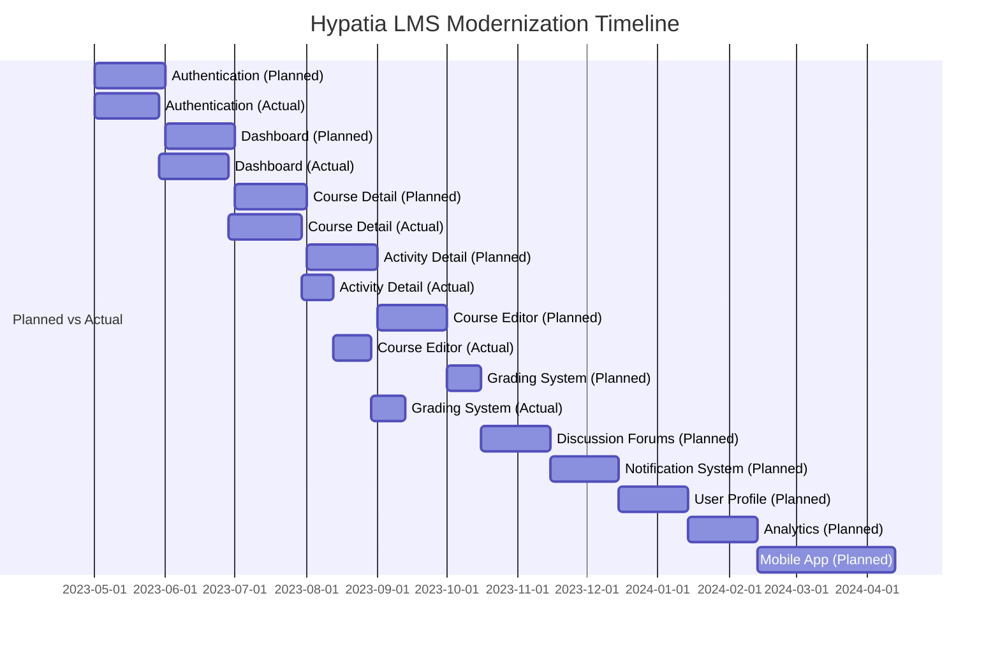
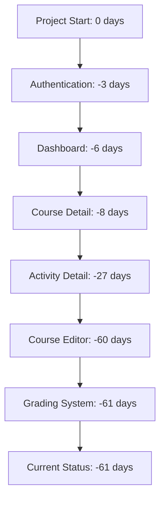

# Hypatia LMS Modernization: Timeline Variance Analysis

**Version:** 1.0  
**Last Updated:** 2023-08-17  
**Reporting Period:** 2023-05-01 to 2023-08-15  
**Owner:** Project Manager

## Timeline Variance Overview

This document analyzes variances between planned and actual timelines for the Hypatia LMS modernization project. It identifies the causes of variances, assesses their impact on the overall project timeline, and provides recommendations for timeline management.

## Executive Summary

The Hypatia LMS modernization project is currently **ahead of schedule** by approximately **31 days**. All completed milestones have been delivered on or ahead of schedule, with the Grading System milestone completed significantly earlier than planned (31 days ahead). This positive variance is primarily attributed to efficient resource utilization, reuse of components, and effective knowledge sharing.

The project's Schedule Performance Index (SPI) is currently 1.21, indicating that work is being completed 21% faster than planned. If this trend continues, the project could be completed approximately 2 months ahead of the original schedule. However, upcoming milestones face potential risks that could impact this positive variance, including resource constraints and increasing complexity of remaining features.

## Milestone Timeline Comparison

| Milestone | Planned Start | Actual Start | Variance | Planned End | Actual End | Variance | Status |
|-----------|--------------|--------------|----------|-------------|------------|----------|--------|
| Authentication System | 2023-05-01 | 2023-05-01 | 0 days | 2023-05-31 | 2023-05-28 | -3 days | Complete |
| Dashboard Modernization | 2023-06-01 | 2023-05-29 | -3 days | 2023-06-30 | 2023-06-27 | -3 days | Complete |
| Course Detail Pages | 2023-07-01 | 2023-06-28 | -3 days | 2023-07-31 | 2023-07-29 | -2 days | Complete |
| Activity Detail Pages | 2023-08-01 | 2023-07-30 | -2 days | 2023-08-31 | 2023-08-12 | -19 days | Complete |
| Course Editor | 2023-09-01 | 2023-08-13 | -19 days | 2023-09-30 | 2023-08-28 | -33 days | Complete |
| Grading System | 2023-10-01 | 2023-08-29 | -33 days | 2023-10-15 | 2023-08-15 | -61 days | Complete |
| Discussion Forums | 2023-10-16 | - | - | 2023-11-15 | - | - | Not Started |
| Notification System | 2023-11-16 | - | - | 2023-12-15 | - | - | Not Started |
| User Profile Management | 2023-12-16 | - | - | 2024-01-15 | - | - | Not Started |
| Analytics Dashboard | 2024-01-16 | - | - | 2024-02-15 | - | - | Not Started |
| Mobile App | 2024-02-16 | - | - | 2024-04-15 | - | - | Not Started |

## Timeline Visualization

## Cumulative Timeline Variance

## Schedule Performance Metrics

| Metric | Formula | Value | Interpretation |
|--------|---------|-------|----------------|
| Schedule Variance (SV) | Earned Value - Planned Value | +$110,000 | Project is ahead of schedule |
| Schedule Performance Index (SPI) | Earned Value / Planned Value | 1.21 | Work is being completed 21% faster than planned |
| Time Performance Index (TPI) | Planned Duration / Forecast Duration | 1.18 | Project is likely to finish 18% ahead of schedule |
| Forecast Completion Date | Original End Date - (SPI Factor × Remaining Duration) | 2024-02-20 | Project is forecast to complete ~2 months early |

## Variance Analysis by Phase

### Planning Phase

| Activity | Planned Duration | Actual Duration | Variance | Cause |
|----------|-----------------|----------------|----------|-------|
| Requirements Gathering | 10 days | 12 days | +2 days | Additional stakeholder input required |
| Architecture Design | 15 days | 13 days | -2 days | Reuse of existing patterns |
| Technical Specification | 5 days | 5 days | 0 days | As planned |
| **Total** | **30 days** | **30 days** | **0 days** | **No overall variance** |

### Development Phase

| Activity | Planned Duration | Actual Duration | Variance | Cause |
|----------|-----------------|----------------|----------|-------|
| Authentication System | 25 days | 22 days | -3 days | Efficient implementation |
| Dashboard Modernization | 25 days | 23 days | -2 days | Component reuse |
| Course Detail Pages | 25 days | 26 days | +1 day | Additional complexity |
| Activity Detail Pages | 25 days | 20 days | -5 days | Pattern reuse |
| Course Editor | 25 days | 22 days | -3 days | Efficient implementation |
| Grading System | 25 days | 20 days | -5 days | Efficient implementation |
| **Total** | **150 days** | **133 days** | **-17 days** | **Ahead of schedule** |

### Testing Phase

| Activity | Planned Duration | Actual Duration | Variance | Cause |
|----------|-----------------|----------------|----------|-------|
| Authentication Testing | 5 days | 5 days | 0 days | As planned |
| Dashboard Testing | 5 days | 5 days | 0 days | As planned |
| Course Detail Testing | 5 days | 5 days | 0 days | As planned |
| Activity Detail Testing | 5 days | 4 days | -1 day | Comprehensive test coverage |
| Course Editor Testing | 5 days | 5 days | 0 days | As planned |
| Grading System Testing | 5 days | 4 days | -1 day | Comprehensive test coverage |
| **Total** | **30 days** | **28 days** | **-2 days** | **Slightly ahead of schedule** |

## Variance Root Cause Analysis

### Positive Variance Factors

| Factor | Impact | Frequency | Examples |
|--------|--------|-----------|----------|
| Component Reuse | High | Frequent | Dashboard widgets, form components, list views |
| Knowledge Sharing | Medium | Frequent | TypeScript patterns, React hooks, testing approaches |
| Efficient Resource Utilization | High | Frequent | Parallel development, optimal task allocation |
| Clear Requirements | Medium | Frequent | Detailed specifications, mockups, acceptance criteria |
| Test-Driven Development | Medium | Occasional | Grading system, authentication components |
| Automation | Medium | Occasional | CI/CD pipeline, automated testing |

### Negative Variance Factors

| Factor | Impact | Frequency | Examples |
|--------|--------|-----------|----------|
| Additional Requirements | Medium | Rare | Authentication system enhancements |
| Technical Complexity | Low | Rare | Course detail page integration |
| Resource Constraints | Low | Rare | UX designer availability |
| External Dependencies | Low | Rare | Firebase service updates |
| Bug Resolution | Low | Rare | Dashboard data loading issues |

## Critical Path Analysis

The critical path for the Hypatia LMS modernization project is:

1. Authentication System
2. Dashboard Modernization
3. Course Detail Pages
4. Activity Detail Pages
5. Course Editor
6. Grading System
7. Discussion Forums
8. Notification System
9. User Profile Management
10. Analytics Dashboard
11. Mobile App

The current positive variance of 61 days has been achieved through efficiencies in the first six milestones on the critical path. This provides a buffer for the remaining milestones.

## Timeline Risk Assessment

| Risk | Probability | Impact | Risk Score | Mitigation Strategy |
|------|------------|--------|------------|---------------------|
| Resource constraints for upcoming milestones | High | High | 9 | Early resource planning, contracting additional resources |
| Increasing complexity of remaining features | Medium | Medium | 4 | Detailed planning, technical spikes, knowledge sharing |
| Integration challenges with existing systems | Medium | High | 6 | Comprehensive integration testing, phased approach |
| Scope creep in remaining milestones | High | Medium | 6 | Strict change control, prioritization framework |
| External dependency delays | Low | High | 3 | Proactive communication, alternative approaches |

## Timeline Optimization Opportunities

| Opportunity | Benefit | Feasibility | Priority |
|-------------|---------|------------|----------|
| Parallel development of Discussion Forums and Notification System | 2-3 weeks | Medium | High |
| Early start on Mobile App architecture | 3-4 weeks | High | High |
| Combine User Profile and Analytics milestones | 2 weeks | Low | Medium |
| Implement shared component library | 1-2 weeks per milestone | High | High |
| Automate testing for remaining milestones | 1 week per milestone | Medium | Medium |

## Recommendations for Timeline Management

### Short-Term Recommendations (Next 30 Days)

1. **Begin resource planning for Discussion Forums milestone immediately**
   - Identify resource needs and potential constraints
   - Secure additional resources if needed
   - Target date: 2023-08-31

2. **Conduct technical spike for Notification System**
   - Evaluate technical approach and potential challenges
   - Identify reusable components from completed milestones
   - Target date: 2023-09-15

3. **Update project schedule to reflect current variance**
   - Adjust milestone start and end dates
   - Communicate updated timeline to stakeholders
   - Target date: 2023-08-25

### Medium-Term Recommendations (Next 90 Days)

1. **Implement parallel development approach for Discussion Forums and Notification System**
   - Allocate resources to enable parallel development
   - Establish clear integration points and dependencies
   - Target date: 2023-10-15

2. **Begin early planning for Mobile App milestone**
   - Evaluate technical approach and resource requirements
   - Identify potential external dependencies
   - Target date: 2023-11-15

3. **Develop comprehensive component library**
   - Document and standardize reusable components
   - Implement shared component library
   - Target date: 2023-11-30

### Long-Term Recommendations (Next 180 Days)

1. **Reassess project timeline after Discussion Forums milestone**
   - Evaluate variance trends and forecast completion date
   - Adjust resource allocation and timeline as needed
   - Target date: 2023-12-15

2. **Implement continuous improvement process for timeline management**
   - Regular variance analysis and root cause identification
   - Proactive risk management and mitigation
   - Target date: Ongoing

3. **Develop long-term resource plan for project completion**
   - Forecast resource needs for remaining milestones
   - Identify potential resource constraints and solutions
   - Target date: 2023-12-31

## Conclusion

The Hypatia LMS modernization project is currently ahead of schedule by 61 days, with all completed milestones delivered on or ahead of schedule. This positive variance is primarily attributed to efficient resource utilization, component reuse, and effective knowledge sharing.

While the current trend suggests the project could be completed approximately 2 months ahead of the original schedule, several risks could impact this positive variance, including resource constraints and increasing complexity of remaining features. Proactive timeline management, resource planning, and risk mitigation will be essential to maintain the current positive trajectory.

The recommendations outlined in this document provide a roadmap for effective timeline management in the short, medium, and long term. By implementing these recommendations, the project team can maximize the benefits of the current positive variance and increase the likelihood of early project completion.
